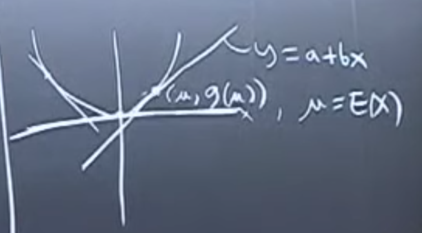

# 1. Pomembne neenakosti

## 1. Cauchy-Schwarz inequality
$$E(XY)\leq \sqrt{E(X^2)E(Y^2)}$$
- v primeru neodivisnosti spremenljivk velja enakost

### Dokaz
- pride direktno iz lastnosti korelacijskega koeficienta  primer $E(Y)=E(X)=\mu = 0$
$$|r(X,Y)|=\left| \frac{E((X-E(X))(Y-E(Y)))}{\sqrt{E(X^2)-E^2(X)}\cdot \sqrt{E(Y^2)-E^2(Y)}} \right| =\left| \frac{E(XY)}{\sqrt{E(X^2)E(Y^2)}} \right| \leq 1$$

## 2. Jensenova neenakost
Ce je $g$ konveksna ($g''(x)>0$), potem
$$E(g(X))\geq g(E(X))$$
Ce je $g$ konkavna potem:
$$E(g(X))\leq g(E(X))$$

### Dokaz
$$g(x) \geq a+bx, \text{ (Vsaka tangenta je pod krivuljo (konveksnost))}$$
$$g(X) \geq a+bX$$
$$E(g(X))\geq E(a+bX)=a+bE(X)=a+b\mu=g(\mu)=g(E(X))$$

### Primeri
$$E(X^2) \geq (E(X))^2$$
$$E\left(\frac{1}{X}\right) \geq \frac{1}{E(X)}$$
$$E(\log(X))\leq \log(E(X))$$

## 3. Markova neenakost
$$P(|X|\geq a) \leq \frac{E(X)}{a}, \forall a >0$$

### Dokaz
$$a I_{|X|\geq a} \leq |X|, \text{vedno drzi}$$ 
- I = 1 ce $|X|>a$
- I = 0 ce $|X|<a$
$$aE(I_{|X|>a}) \leq E(X)$$

## 4. Chebyshev inequality
$$P(|X-\mu| > a) \leq \frac{\text{Var}(X)}{a^2}$$
$$P(|X-\mu|>c\cdot\text{SD}(X))\leq \frac{1}{c^2}$$

# 2. Law Of Large Numbers - Bernoullijev zakon velikih stevil
Naj bojo $X_1, X_2, \dots$ enake slucajne spremenljivke z pricakovano vrednostjo $\mu$ in varianco $\sigma^2$.

Naj bo $\overline{X}=\frac{1}{n} \sum\limits_{i=1}^{n} X_i$ vzorcno povprecje

### (Mocen) Zakon velikih stevil
$$\overline{X} \rightarrow \mu, \text{ ko } n \rightarrow \infty \text{ z verjetnostjo 1}$$

### (Sibek) Zakon velikih stevil
$$\forall c>0, P(|\overline{X}-\mu| > c) \rightarrow 0$$

#### Dokaz
Uporabimo Chebyshevo neenakost
$$P(|\overline{X}_ n-\mu| > c) \leq \frac{Var(\overline{X})}{c^2}=\frac{\frac{1}{n^2} n\sigma^2}{c^2}=\frac{\sigma^2}{nc^2}\rightarrow 0$$

### (Primer)
$$X_i \sim B(p)$$
$$\overline{X} = \sum\limits_{i=1}^n X_i = p, \text{ za n } \rightarrow \infty$$

# 3. CLI
