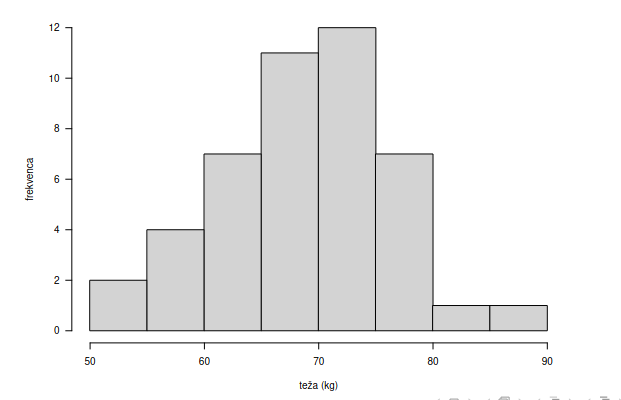
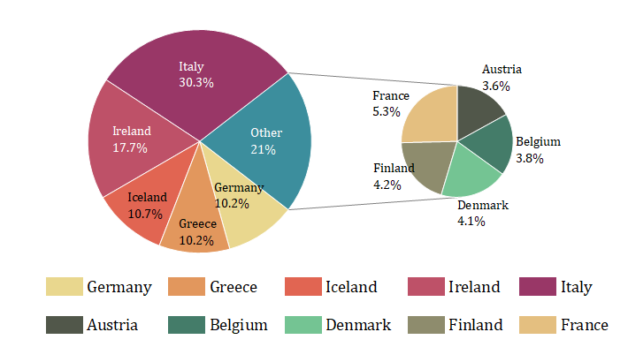
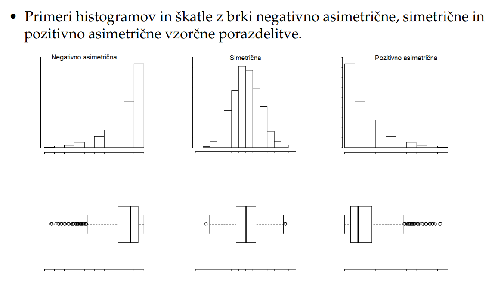
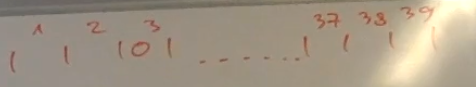
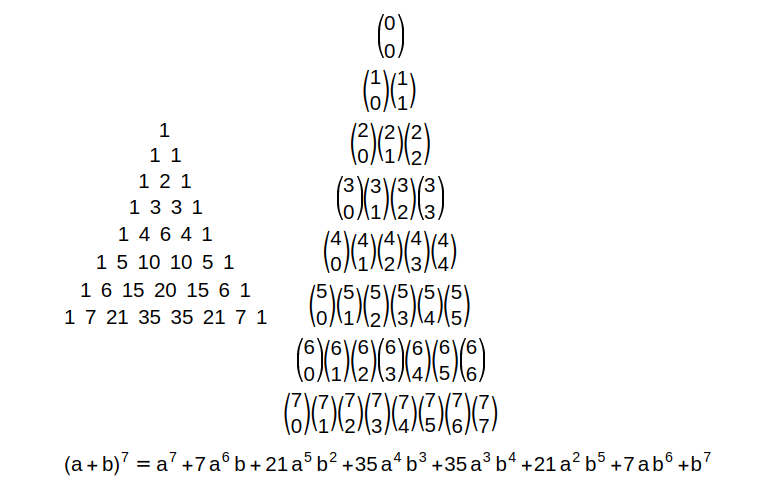
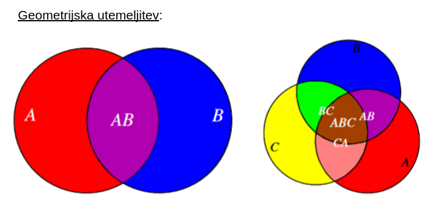
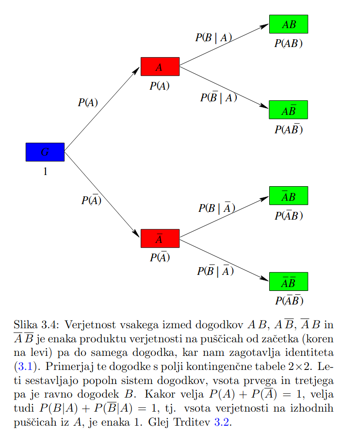
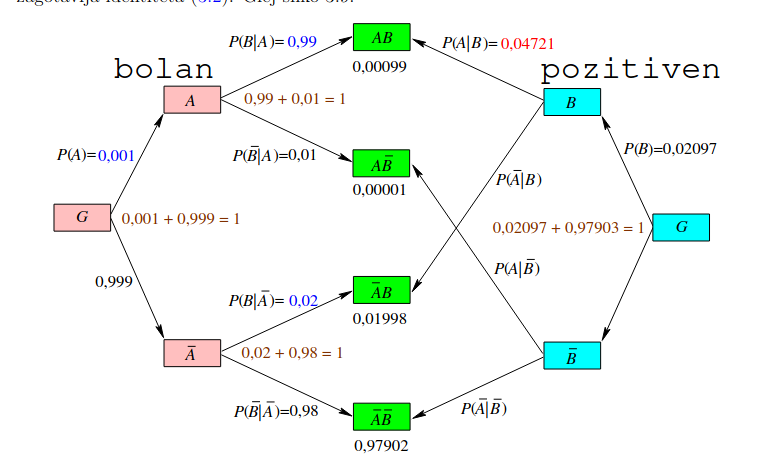

# 0. Ponovitev snovi iz srednje sole

## 1. Opisna statistika

1. `Vrste slucajnih spremelnjivk, primeri`

   - Slucajna spremenljivka X je kolicina, katere vrednosti so rezultat slucajnega poskusa
   - <u>**numericne**</u>:
     - **diskretne**: met kovanca, streljanje na tarco, ...
     - **zvezne**: verjetnost da se pri 100 metih kovanca frekvenca grba ne razliku za vec kot 0.5
   - <u>**kategoricne**</u>: (imajo kategorije za vrednosti)
     - **nominalne (imenske)**: kategorije brez vrstenga reda / urejenosti
       - spol: 0 = moski, 1 = zenski
       - barva las: 1 = crna, 2 = rjava, 3 = rdeca, 4 = blond, 5 = bela
     - **ordinalne** (urejenostne): kategorije z vrstnim redom / urejenostjo
       - stopnja bolecine: 0 = ni, 1 = blaga, 2 = srednja, 3 = mocna
       - stopnja izobrazbe: 1 = brez, 2 = osnovna sola, 3 = srednja sola, 4 = fakulteta

1. `Frekvenca porazdelitev`

   - tabela skupin vrednosti (razredov) in njihovih frekvenc v podatkih
   - obstaja min, max, spodnja, zgornja meja, sirina, sredina rezreda, komulativna frekvenca, relativna frekvence

     - primer zabelezili smo krvno skupino nakljucnega vzorca 100 slovencev.

     | Krvna Skupina | 0   | A   | B   | AB  |
     | ------------- | --- | --- | --- | --- |
     | frekvenca f   | 38  | 40  | 15  | 7   |

1. `Graficni prikaz podatkov`

   - **Histogram**
     - podatke razdelimo v **razrede (intervale)** in prestejemo stevilo podatkov v vsakem razredu
     - z $n$ podatkov je potrebno stevilo razredov: $\lceil \log_2(n) \rceil + 1$
     - dolzina razreda: h = $\frac{max-min}{k}$
     - npr. imamo 45 podatkov o tezi (n=45)
       - minimalna teza = 52.3kg, maksimalna = 86kg
       - potrebujemo $k=\lceil \log_2(45)\rceil+1=7$ rezredov
       - dolzina razreda: $h=\frac{max-min}{k}=\frac{86-52.3}{7}=4.8 \approx 5$
       

   - **tortni diagram**
     - vsakemu razredu priredimo krozni odsek
     - kot $\alpha_i= \frac{f_i}{n} \cdot 360\text{degrees}$
     

   - **Skatla z brki**
     - Mediana navpicna crta v skatli
     - Meje skatle $Q_1$ in $Q_3$
     - Dolzina skatle IQR=$Q_3-Q_1$
     - Spodnja meja = $Q_1 - 1.5\cdot IQR$
     - Zgornja meja = $Q_1 + 1.5 \cdot IQR$
     - Podatki ki so mansi od spodnje ali vecje od zgornje meje se imenujejo **osamelci**
       

   - Primeri razlicnih tipov histrogramov in skatel z brkami

        

1. `Grafi in opisna statistika glede na vrsto slucajne spremenljivke`

   - Kategoricne spremenljivke

   | Podatki   | Opisna Statistika        | Grafi             |
   | --------- | ------------------------ | ----------------- |
   | Nominalni | Modus                    | Stolpicni diagram |
   | Ordianlni | Modus, mediana, kvartili | Stolpicni diagram |

   - Numericne spremenlijvke

   | Podatki   | Opisna Statistika                                       | Grafi                                                                                                |
   | --------- | ------------------------------------------------------- | ---------------------------------------------------------------------------------------------------- |
   | Diskretni | povprecje, standardni odklon, povzetek s petimi stevili | **Malo stevilo vrednosti**: stolpicni diagram, **Vecje stevilo vrednosti**: histogram, skatla z brki |
   | Zvezni    | povprecje, standardni odklon, povzetek s petimi stevili | Histogram, skatla z brki                                                                             |

1. `Vzorcne statistike`

- **ordinalne slucajne spremenljivke**
  - Lahko jim izracunamo modus, vzorcno mediano in vzorcne kvartile
    - Podatke razvrstimo po vrsti $Y_1 \leq Y_2 \leq \dots \leq Y_n$
      - npr stopnje bolecine: $0,0,1,1,1,1,1,1,1,2,2,2,2,2,2,2,2,3,3,3$
    - <u>Modus</u> (najpogostejsa vrednost) = 2
    - <u>Mediana</u> predstavlja srednji podatek = 2
    - <u>Prvi kvartil</u> $Q_1$ je mediana prve polovice sortiranih podatkov = 1
    - <u>Tretji kvartil</u> $Q_3$ je mediana druge polovice sortiranih podatkov = 2
- **zvezne slucajne spremenljivke**:
  - Vzorcno povprecje: $\overline{X}=\frac{1}{n} \sum\limits_{i=1}^n X_i$
  - Popravljeni vzorcni standardni odklon $S=\sqrt{\frac{1}{n-1} \sum\limits_{i=1}^n (X_i-\overline{X})^2}$
  - povzetek s petimi stevili: minimum, maksimum, mediana, prvi in tretji kvartil
  - itn.
- **diskretne slucajne spremenljivke**:

  - enako kot zvezne (vzorcno povprecje, vzorcni standardni odklon, povzetek s petimi stevili)

- **Slucajni vzorec**: slucajno zbranih n enot populacije v vzorec

## 2. Kombinatorika in prestevanje

- `Pojasni pravili za vsoto in produkt, ki ju uporabljamo pri stetju`
  - <u>**vsota**</u>:
    - Kadar se pri izbiranju odlocamo za eno od $n_1$ moznosti iz prve mnozice <u>ali</u> za eno od $n_2$ moznosti iz druge,
      .... <u>ali</u> za eno od $n_k$ moznosti iz tretje in so te mnozice paroma disjkunktne, potem je stevilo **vseh moznih izidov**
      $$\sum\limits_{i=1}^k n_i=n_1+n_2+n_3+\dots n_k$$
  - <u>produkt</u>
    - Izbiranje poteka v k korakih, na vsakem koraku imamo $n_i$ moznosti.
    - Vseh moznosti: $\prod\limits_{i=1}^{k} n_i = n_1 \cdot n_2\cdot n_3 \cdots n_k$
- `Definiraj permutacije (in omeni kaksen primer)`
  - vrstni red je pomemben
  - `brez ponavljanja`
    - So vse mozne razporeditve n razlicnih elementov na n prostih mest
    - $n!=n\cdot(n-1)\cdot(n-2)\cdots 2\cdot 1$
    - Primer: Imamo 5 mest in 5 stevil {1,2,3,4,5}, koliko razlicnih stevil lahko sestavimo ce moremo vsako stevko uporabiti natanko enkrat
  - `s ponavljanjem`
    - razporeditve $n$ **ne nujno razlicnih** elementov
    - Elemente razdelimo v **skupine** enakih
    - Ce je teh skupin m, in ima vsaka skupin $k_i$ elementov
      $$\begin{pmatrix} n \\ k_1, k_2,\dots k_m\end{pmatrix} = \frac{n!}{k_1!\cdots k_m!}$$
- `Definiraj variacije (in omeni kaksen primer)`
  - Vrstni red je pomemben
  - `brez ponavaljanja`
    - Razporeditev $n$ razlicnih elementov na $k$ prostih mest vsak element najvec enkrat nastopi
    - $$\frac{n!}{(n-k)!}=n\cdot (n-1) \cdot (n-2) \cdots (n-k+1)$$
    - Imamo 3 mesta ter 5 stevil. Koliko razlicnih stevil lahko sestavimo ce lahko vsako stevko uporabimo najvec enkrat
    - $5\cdot 4\cdot 3$
  - `s ponavaljanjem`
    - Razporeditve $n$ razlicnih elementov na $k$ mest vsak element uporabimo poljubno krat
    - $n^k= n \cdot n \cdots n$
- `Definiraj kombinacije (in omeni kaksen primer)`
  - vrstni red ni pomemben
  - `brez ponavljanja`
    - So izbire k elementov izmed n razlicnih elementov (vsak element lahko izberemo najvec enkrat)
      $$\begin{pmatrix}n \\ k\end{pmatrix}=\frac{n!}{k!(n-k)!}$$
    - Imamo 4 razlicne kroglice. Na koliko razlicnih nacinov lahko izberemo 2.
      - $\begin{pmatrix}4 \\ 2\end{pmatrix}= \frac{4\cdot 3\cdot 2!}{2! \cdot (4-2)!}=\frac{12}{2}=6$
        - 12, 13, 14, 23, 24, 34
  - `s ponavljanjem`
    - So izbire k elementov izmed n razlicnih elementov (vsak element lahko izberemo veckrat)
    - **Loterija**: zreb 7 stevil izmed 39 kroglic, ki se po vsakem krogu vracajo v boben.
    - Z crticami oznacimo 39 predalckov, vsakic ko vlecemo neko kroglico jo dodamo v predalcek
        

    - S takim nizom lahko predstavimo vse mozne kombinacije (bijekcija)
      - presteti moramo vse nize take oblike **k=7 krogcev**, **n+1=40 crtic** $\rightarrow$ prve in zadnje se znebimo ker sta fiksni $\rightarrow$ dobimo 38 crtic (n-1))
      - torej izmed k+n-1 mest moramo izbrati k mest kamor narisemo krogec (oz n-1 mest za crtico)
      - Torej dobimo $\begin{pmatrix} k+n-1 \\ k\end{pmatrix}=\begin{pmatrix}7+38 \\ 7\end{pmatrix}$
    - $\begin{pmatrix}\begin{pmatrix}n \\ k\end{pmatrix}\end{pmatrix}=\begin{pmatrix}k+n-1 \\ k\end{pmatrix}$
- `Iz zgornje definicije izpelji posebna primera: permutacije, kombinacije`
  - **kombinacije**: variacije brez vrstnega reda
    - pri variacijah se znebimo ponovitev tako da v imenovalec dodamo r!
  - **permutacije**: so variacije kjer je (st mest) k = n
    - dobimo $\frac{n!}{(n-n)!}=n!$
- `Podaj binomski obrazec in definiraj Pascalov trikotnik`
  - $(a+b)^n=\sum\limits_{k=0}^n \begin{pmatrix}n\\ k \end{pmatrix} a^{n-k}b^k$
  - Pravilo pascalovega trikotnika $\begin{pmatrix}n \\ m \end{pmatrix} + \begin{pmatrix}n \\ m+1 \end{pmatrix} = \begin{pmatrix}n+1 \\ m+1 \end{pmatrix}$
    

- `Z limito vpelji stevilo e = 2.71 ki predstavlja osnovo za naravni logaritem`
  - $e=\lim\limits_{n\rightarrow \infty} (1+\frac{1}{n})^n$
  - Razpisemo $(1+\frac{1}{n})^n= 1 + \begin{pmatrix}n \\ 1 \end{pmatrix} \frac{1}{n} + \begin{pmatrix}n \\ 2 \end{pmatrix} \frac{1}{n^2} + \cdots \begin{pmatrix} n \\ n \end{pmatrix} \frac{1}{n^n}$
  - Vsota celotnega torej: $1+\frac{1}{1!}+\frac{1}{2!}+\dots + \frac{1}{n!}=e$
- `Podaj primer, kjer pridemo do tega stevila v kombinatoriki`
  - poissonova porazdelitev
  - $p_k= \lambda^k \cdot \frac{e^{-\lambda}}{k!}$

## 3. Racunanje z dogodki

- `Definiraj prostor dogodkov (tudi nemogoc, gotov in nasproten)`
  - $\Omega \equiv$ verjetnostni prostor $\equiv$ mnozica vseh izidov
  - **Dogodek** A $\subseteq \Omega$
  - **verjetnost** $P(A)=\frac{|A|}{|\Omega|}=\frac{\text{st. ugodnih izidov}}{\text{st. vseh izidov}} \in [0,1]$
  - **Gotov** dogodek: $P(\Omega)$ = 1, dogodek ki se zgodi ob vsakem poskusu
  - **Nemogoc** dogodoek: $P(\emptyset)$ = 0
  - **Nasproten** dogodek: $P(A^C)=1-P(A)$ (komplementarna mnozica)
    - v vsakem poskusu se zgodi ali $A$ ali $A^C$
- `Definiraj vsoto dveh dogodkov`
  - Vsota dogodkov je predstavljena z **unijo** (ali se zgodi en ali drug)
    - $P(A\cup B)=P(A)+P(B)-P(A\cap B)$
- `Definiraj Produkt dveh dogodkov`
  - Produkt dveh dogodkov je verjetnost da se zgodita oba dogodka hkrati (presek)
    - $P(A\cap B)=P(A)+P(B)-P(A\cup B)$
- `Nastej lastnosti za vsoto dveh dogodkov`
  - $P(A\cup B)= P(B\cup A)$
  - $P(A\cup A)= P(A)$
  - $P(A\cup \Omega)=P(\Omega)$
  - $P(A\cup \emptyset)=P(A)$
- `Nastej lastnosti za produkt dveh dogodkov`
  - $P(AB)=P(BA)$
  - $P(AA)=P(A)$
  - $P(A\Omega)=P(A)$
  - $P(A\emptyset)=\emptyset$
- `Podaj pravilo o vkljucitvi/izkljucitvi`
  - $P(A\cup B \cup C)=P(A)+P(B)+P(C)-P(A\cap B)-P(B\cap C)-P(A\cap C)+P(A\cap B \cap C)$

## 4. Popoln sistem dogodkov in definicije vrjetnosti

- `Podaj najmanjsi popoln sistem dogodkov`
  - $\Omega$ (samo 1 gotov dogodek)
- `Kdaj je mnozica dogodkov popoln sistem`
  - imamo mnozico dogodkov $H_1, H_2 \dots, H_n$
  - da je popoln sistem mora veljati
    - $\bigcup\limits_{i=1}^n H_i = \Omega$
    - $H_i \cap H_j =\emptyset, \forall i,j \land i\neq j$
- `Statisticna definicja verjetnosti`
  - Verjetnost dogodka A v danem poskusu je stevilo P(A) pri katerem se navadno ustali relativna frekvenca dogodka A v velikem stevilu ponovitev poskusa
    - relativna: $f(A) = \frac{k}{n}$, k stevilo ugodnih, n stevilo poskusov
- `Klasicna definicija verjetnosti (izpeljava)`
  - $P(A)=\frac{|A|}{|\Omega|}=\frac{\text{st. izidov v A}}{\text{st. vseh izidov}}$
- `Geometricna definicija vrjetnosti`
  - $P(A)=\frac{\text{mera (A)}}{\text{mera }(\Omega)}$, mera je dolzina, ploscina, volumen, ...
- `Podaj zvezo med verjetnostmi dveh dogodkov ter njunima vsoto in produktom (in jo utemelji bodisi s statisticno ali geometrijsko definicjo verjetnosti)`

  - $P(A\cap B)= P(A) + P(B) - P(A\cup B)$
  - $P(A\cup B) = P(A) + P(B) - P(A\cap B)$

      

## 5. Pogojna verjetnost

- `Primer`
  - Vrzemo dve kocki
  - $A\equiv$ na prvi kocki pade 6 pik
  - $B\equiv$ skupaj pade 10pik
  - $P(A\mid B)$ koliksna je verjetnost da je na prvi kocki padlo 6 pik ce vemo da je bila vsota na obeh kockah 10
- `Definiraj pogojno verjetnost (s kompleksom pogojev)`
  - $P(A\mid B)=\frac{P(A\cap B)}{P(B)}$
  - Ce sta dogodka neodvisna $\rightarrow P(A\cap B)=P(A)P(B)$
    - $P(A\mid B) = P(A)$
- `Podaj formulo, ki poveze obicajno in pogojno verjetnost`
  - $P(A\cap B)=P(B)P(A\mid B)$
  - $P(A\cap B)=P(A)P(B\mid A)$
  - $P(A)P(B\mid A)=P(B)P(A \mid B)$
- `Zakaj je pomembna graficna predstavitev z drevesom`
  

  - TODO
- `Izpelji formulo za racunanje pogojne verjetnosti (z uporabo statisticne definicije verjetnosti in/ali geometrijske definicije verjetnosti)`
  - TODO

## 6. Dvofazni poskusi

- `definicija popolnega sistema dogodkov`
  - [zgoraj](#5.-pogojna-verjetnost)
- `formula za pogojno verjetnost`
  - [zgoraj](#5.-pogojna-verjetnost)
- `primer`
  - Redko nalezljivo bolezen dobi ena oseba na 1000. Imamo dober a nepopolen test za to bolezen: ce imam neka oseba to bolezen potem test pokaze to v 99% primerih
  - Test napacno pokaze 2% pacientov za bolanih
  - A: pacient je dobil nalezjlivo bolezen
  - B: pacientov test je bil pozitiven
  - $P(A)=0.001$
  - $P(B|A)=0.99$
  - $P(B|\overline{A})=0.02$ (dogodek "napacno pooizitven")
  - Zanima nas $P(A|B)$, verjetnost da smo se nalezli ce je test pozitiven
- `drevesna struktura`

    

- `nepopolna formula`
- `formula za popolno verjetnost`
  1. $A=(A_1\cap H_1) \cup (A_1\cap H_2) \cup \dots \cup (A_1 \cap H_n)$
  1. $P(A)= P(A \cap H_1) + \dots + P(A\cap H_n)$
     - $P(A \mid H_1) = \frac{P(A\cap H_1)}{P(H_1)} \rightarrow P(A\cap H_1)= P(A\mid H_1)\cdot P(H_1)$
  1. $P(A)=P(A|H_1)P(H_1)+P(A|H_2)P(H_2)+\dots P(A|H_n)P(H_n)=\sum\limits_{i=1}^nP(A|H_i)P(H_i)$
- `Bayesov obrazec`
  - za popoln sistem dogodkov $H_i$
  - $P(H_i\mid A)=\frac{P(H_i)\cdot P(A\mid H_i)}{P(A)}=\frac{P(H_k)\cdot P(A\mid H_i)}{\sum\limits_{k=1}^nP(H_k)\cdot P(A\mid H_k)}$
- `Dokaz za Beysov obrazec in formulo za popolno verjetnost`
  - zgornja izpeljava samo po definiciji (mnozic)

## 7. Bernullijevo zaporedje neodvisnih poskusov

- `primeri`
  - verjetnosti izidov v enem poskusu neodvisne od tega kar se je zgodilo v drugih poskusih
  - V vsakem poskusu se lahko zgodi dogodek $A$ ali pa $\overline{A}$
  - mecemo kovanec:
  - $P(A)= 0.5$ (pade cifra)
  - $P(\overline{A})=0.5$ (pade grb)
- `vecfazni poskusi`
- `kombinacije`
- `drevesna predstavitev`
    

- `nepopolna formula`
- `formula za racunanje verjetnosti (binomska porazdelitev)`
  - verjetnost da se dogodek A zgodi k krat v n zaporednih poskusih:
    $$P_n(k)=\begin{pmatrix}n \\ k \end{pmatrix} p^k (1-p)^{n-k}$$
- `racunanje verjetnosti in/ali Laplacoev tockovni obrazec`
  - TODO
- `zveza med binomsko in normalno porazdelitvijo i/ali Poissonovo porazdelitvijo`
  - TODO
- `Dokazovanje pricakovane vrednosti z indikatorji`
  - TODO

## 8. Sredine

- `aritemticna sredina (k=1)`
  - $$A_n = \frac{a_1+\cdots + a_n}{n}$$
- `geometrijska sredina (k=0)`
  - $$G_n=\sqrt[n]{a_1 \cdot ... \cdot a_n}$$
- `kvadratna sredina (k=2)`
  - $$K_n=\sqrt{\frac{a_1^2+\cdots+a_n^2}{n}}$$
- `harmonoicna sredina (k=-1)`
  - $$H_n=\frac{n}{\frac{1}{a_1}+\cdots + \frac{1}{a_n}}$$
- `potencna sredina stopnje k`
  - $$P_{n,k}=\sqrt[k]{\frac{a_1^k+\cdots +a_n^k}{n}}$$
- `neenakosti med njimi`
  - Sredine dveh stevil
    $$H_2\leq G_2 \leq A_2 \leq K_2$$
- `dokaz` $A_2 \geq G_2$ `(in karakterizacija enakosti)`
  - $\frac{a+b}{2} \geq \sqrt{ab}$
  - $\frac{a^2+2ab+b^2}{4} \geq ab$
  - $a^2+b^2 - 2ab \geq 0$
  - $(a-b)^2 \geq 0$
- `dokaz` $K_2\geq A_2$ `(in karakterizacija enakosti)`
  - $\sqrt{\frac{a^2+b^2}{2}} \geq \frac{a+b}{2}$
  - $\frac{a^2+b^2}{2} \geq \frac{a^2+b^2+2ab}{4}$
  - $\frac{a^2+b^2-2ab}{4} \geq 0$
  - $\frac{(a-b)^2}{4} \geq 0$
- `dokaz brez besed`
