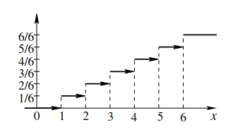
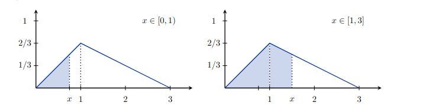
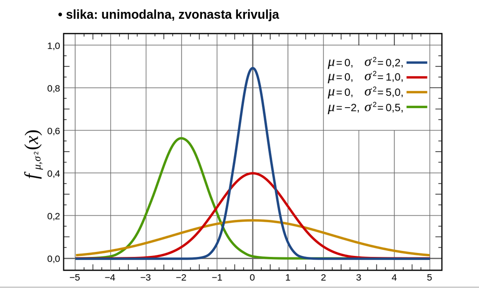
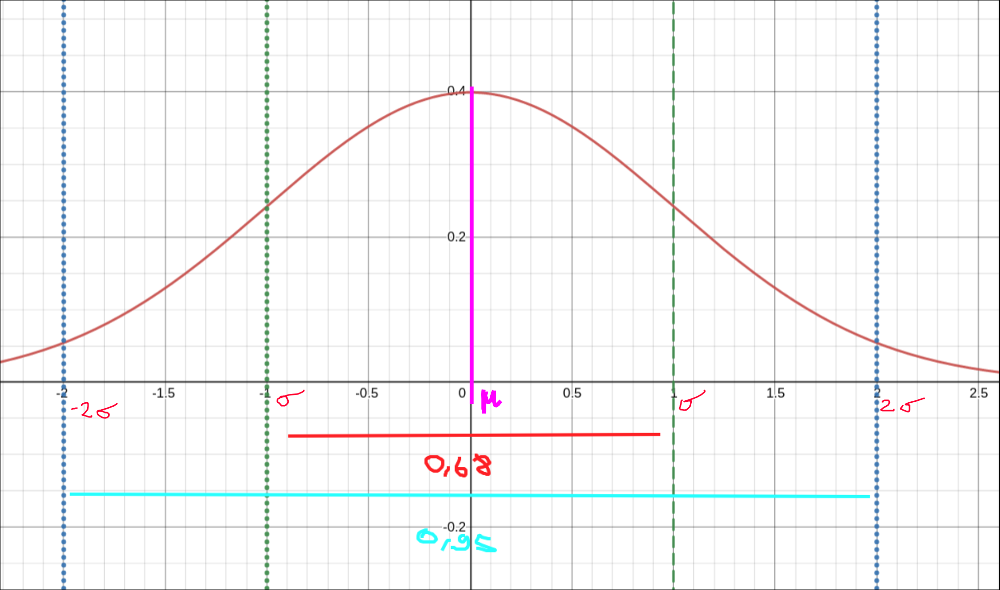
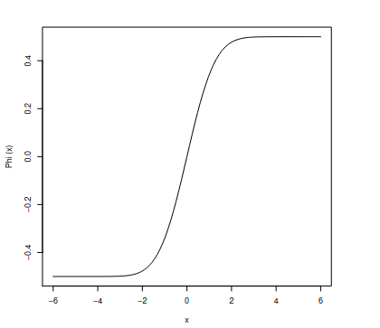
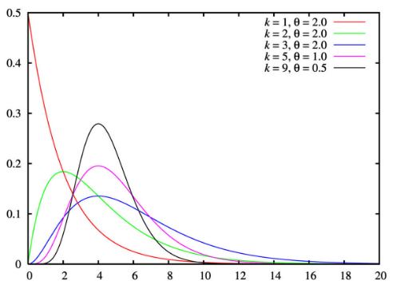

# 1. Del

## 1. Slucajne spremenljivke

- `primeri`
  - Imamo nek poskus katerega izidi so stevila (npr. met kocke). Se pravi da je poskusom prirejena neka kolicina ki mora zavzeti rezlicne vrednosti.
      -  Vrednost, ki jo zavzame v doloceni ponovitvni poskusa je odvisno od slucaja.
  - Primer: Vrzemo kocko, pade lahko od 1-6 pik, vsi izidi so enako vrjetni
  - $X \sim \begin{pmatrix}1 && 2 && 3 && 4 && 5 && 6 \\ \frac{1}{6} && \frac{1}{6} && \frac{1}{6} && \frac{1}{6} && \frac{1}{6} && \frac{1}{6} \end{pmatrix}$
- `definicija (zaloga vrednosti in porazdelitveni zakon)`
  - __Zaloga vrednosti__ $Z_X$: vrednosti ki jih slucajna spremenljivka lahko zavzam
  - __Porazdelitveni zakon__ - predpis, ki doloca verjetnost vsake izmed
  moznih vednosti ali intervala vrednosti, ki ga s.s. lahko zavzame
- `porazdelitvena funkcija`
  - $F_X(x)=P(X\leq x)$
- `lastnosti porazdelitvene funkcije`
  1. Funkcija F je definirana na vsem $\mathbb{R}$ in zanjo velja $0\leq F(x)\leq 1 \forall x \in \mathbb{R}$
  1. F je nepadajoca
  1. $F(-\infty) := \lim\limits_{x\rightarrow -\infty}F_X(x)=0$
  1. $F(\infty) := \lim\limits_{x\rightarrow \infty}F_X(x)=1$
  1. Funkcija je v vsaki tocki zvezna z desne
  1. Funkcija ima lahko v nekaterih tockah skok
  1. $P(x_1 < X \leq x_2)=F(x_2)-F(x_1)$
  1. $P(X>x)=1-F(x)$
  1. $P(X=x)=F(x)-F(x-)$
- `diskretna, zvezna`
  - **diskretna**: zaloga vrednosti je stevna mnozica
  - **zvezna**: lahko zavzame vsako realno stevilo znotraj dolocenega intervala (koncnega/neskoncnega)
- `primer mesane slucajne spremenljivke`
  - kombinirana: na nekem obmocju diskretna na nekem zvezna
  - primer: kolicina padavin v nekem kraju v dolocenem casovnem obdobju
    - npr: dan brez padavni ima vrednost 0
    - zvezno obmocje padavin za dneve ko so padavine

## 2. Diskretne slucajne spremenljivke

- `primer tabele`
  - $X\equiv$ izidi pri metu pravicne kocke
  - $X \sim \begin{pmatrix}1 && 2 && 3 && 4 && 5 && 6 \\ \frac{1}{6} && \frac{1}{6} && \frac{1}{6} && \frac{1}{6} && \frac{1}{6} && \frac{1}{6} \end{pmatrix}$
- `primeri: enakomerna, binomska, Poissonova, Pascalova, Hipergeometrijska`
  - `bernoullijeva` $\sim B(p)$
    - V vsakem poskusu ima dogodek A verjetnost p, X pa ima vrednost 1, ce se je zgodil dogodek A in 0 sicer
    - $P(X=1)=p$
    - $P(X=0)=1-p$
  - `binomska` $\sim B(n,p)$
    - Kovanec vrzemo n-krat, koliksna je verjetnost da pade cifra z verjetnostjo p
    - $p_k=P(X=k)=\begin{pmatrix}n\\k\end{pmatrix} p^k (1-p)^{n-k}$
  - `Geometrijska` $\sim G(p)$
    - X je stevilo ponovitev poskusa do (vkljucno) prve pojavitve izida A
    - X = st. poskusov da prvic pade 6
    - $P(X=k)=(1-p)^{k-1}p$
  - `Pascalova/Negativna binomska` $\sim P(n,p)$
    - X je stevilo ponovitev poskusa do (vkljucno) n-te pojavitve izida A
      - npr. koliko poskusov rabimo do 10. sestice
    - $P(X=k)=\begin{pmatrix}k-1 \\ n-1\end{pmatrix}p^{k-n}(1-p)^n$
  - `Hipergeometrijska` $\sim H(R,B,n)$
    - X je stevilo rdecih kroglic med izbranimi n kroglicami
    - $P(X=k)=\frac{\begin{pmatrix}R\\k\end{pmatrix}\begin{pmatrix}B\\n-k\end{pmatrix}}{\begin{pmatrix}R+B \\ n\end{pmatrix}}$
  - `Poissonova` $X\sim P(\lambda)$
    - V povprecju imamo na intervalu $\lambda$ ponovited dogdka A
    - X pa je stevilo ponovitev dogodka A na danem intervalu
    - $P(X=k)=\frac{\lambda^k}{k!}\cdot e^{-\lambda}$
- `definicija (tabela, zaloga vrednosti je stevna mnozica)`
  - **zaloga vrednosti** je stevna mnozica {$x_1, x_2, \dots, x_n, \dots$}
  - dogodki $X=x_k$ $\forall k$ predstawvljajo popoln sistem dogodkov
  - verjetnost dogodka $P(X=x_i)=p_i$
  - $\sum\limits_{i} p_i=1$
  - **verjetnostna tabela**, v prvi vrstici imamo vrednosti $x_i\in Z_X$ v drugi vrstici $P(X=x_i)=p_i$
    $$X\sim \begin{pmatrix} x_1 && x_2 && \dots && x_m && \dots \\ p_1 && p_2 && \dots && p_m && \dots \end{pmatrix}$$
- `porazdelitvena funkcija je stopnicasta funkcija`

  - Porazdelitvena funkcija ni zvezna je stopnicasta

      

- `izpeljava netrivialne pricakovane vrednosti ali odklona`
  - **pricakovana vrednost E(X)** diskretne spremenljivke X je posplositev povprecne vrednosti / tezisca
  - $\overline{X}=\frac{x_1k_1+\cdots + x_mk_m}{N}=x_1 f_1+\cdots + x_mf_m=x_1p_1 + \cdots x_mp_m= E(X)$

## 3. Poissonova porazdelitev

- `primer`
    - Neka rokometna ekipa da v __povprecju 30 golov__ na tekmo (tekma traja __60min__).
        - Koliko verjetno ekipa na naslednji tekmi v prvi minuti doseze vsaj en gol?
            - $t = 1\text{min}, \rightarrow \lambda = 0.5$
            - $P(X\geq 1)= 1 - F_X(0)= 1 - \frac{0.5^0\cdot e^{-0.5}}{0!}=1-e^{0.5}$
        - Koliko verjetno ekipa v zadnjih 3min tekme doseze natanko dva gola? 
            - $t=3\text{min}\rightarrow  \lambda=\frac{3}{2}$
            - $P(X=2)= \frac{(\frac{3}{2})^2 \cdot e^{-\frac{3}{2}}}{2!}\approx 0.251$
- `zaloga vrednosti`
  - **stevna** a **neomejena** (teoreticno se lahko zgodi neskoncno mnogo dogodkov na danem intervalu)
- `predpostavke`
  - dogodki morajo biti porazdeljeni po Poissonu
    - dogodki se pojavijo __neodvisno__ od casa, ki je potekel od zadnjega dogodka
    - povprecno stevilo dogodkov ki se pojavijo na nekem intervalu je __konstnatno__ - $\lambda$
- `definicija - verjetnostna funkcija`
  - $p_k=P(X=k)=\lambda^k \frac{e^{-\lambda}}{k!}$
- `povezava z binomsko porazdelitvijo`
  - Poissonova porazdelitev se lahko dobi kot limitni primer binomske porazdelitve (ce gre stevilo poskusov preko vseh mej)
  - Torej Poissonova porazdelitev je aproksimacija binomske porazdelitve ce je n dovolj velik in p dovolj majhen
    - $X\sim B(n,p) \approx P(np)$
  - **Dokaz:**
    - imamo $P(X=k)=\lim\limits_{n\rightarrow \infty}\left(\frac{n!}{k!(n-k)!}p^k (1-p)^{n-k}\right)$
      - Vpeljemo $\lambda =np \rightarrow p = \frac{\lambda}{n}$
        $$P(X=k)=\lim\limits_{n\rightarrow \infty}\left( \frac{n!}{k!(n-k)!}\cdot \frac{\lambda^k}{n^k}\cdot \left(1-\frac{\lambda}{n}\right)^n\cdot \left(1-\frac{\lambda}{n}\right)^{-k}\right)= $$
      - Upostevamo: $\lim\limits_{n\rightarrow \infty} (1-\frac{\lambda}{n})^n=e^{-\lambda}$ ter $\lim\limits_{n\rightarrow \infty} (1-\frac{\lambda}{n})^{-x}=1$
        $$P(X=k)=\lim\limits_{n\rightarrow \infty}\left( \frac{n!}{k!(n-k)!}\cdot \frac{\lambda^k}{n^k}\cdot e^{-\lambda}\right)= $$
      - Konstante premaknemo ven iz limite.
        $$=\frac{\lambda^k}{k!}e^{-\lambda}\lim\limits_{n\rightarrow \infty} \left(\frac{n!}{(n-k)!}\cdot\frac{1}{n^k}\right)=$$
        $$=\frac{\lambda^k}{k!}e^{-\lambda}\lim\limits_{n\rightarrow \infty} \left(\frac{n\cdot (n-1)\cdot (n-2)\cdots (n-k)!}{(n-k)!\cdot n^k}\right)=$$
        $$=\frac{\lambda^k}{k!}e^{-\lambda}\lim\limits_{n\rightarrow \infty} \left(\frac{n(n-1)(n-2)\cdots(n-k+1)}{n^k}\right)=$$
        $$=\frac{\lambda^k}{k!}e^{-\lambda}\lim\limits_{n\rightarrow \infty} \left((\frac{n}{n})(\frac{n-1}{n})\cdots(\frac{n-k+1}{n})\right)=$$
      - Vidimo da v limiti grejo vsi notranji cleni $\rightarrow 1$
        $$=\frac{e^{-\lambda}\lambda^k}{k!}$$
- `razlaga parametra` $\lambda$
  - st. ponovitev dogodka A, ki jih imamo v povprecju na nekem intervalu
- `priackovana vrednost in disperzija`
  - $E(X)=\lambda$
  - $D(X)=\lambda$
    - $D(X)=E((X-E(X))^2)=E(X^2+E^2(X)-2XE(X))=E(X^2)+E^2(X)-2E(X)E(X)=E(X^2)-E^2(X)$
    - Upostevali smo (linearnost in konstante):
    - $E(E^2(X)))=E^2(X)$, **E(konstanta)=konstanta**
    - $E(-2XE(X))=-2E(X)E(X)$ (konstanto premaknemo vn)
- `Poissonov obrazec`
  - $B(n,p)\approx P(np)$
    - dokaz zgoraj 

## 4. Pascalova porazdelitev

- `primeri (npr. geometrijska)`
  - Naj bo X stevilo metov postenega kovanca, ki ga mecemo dokler ne pade cifra in takoj nato grb.
  - $X_1\sim G(\frac{1}{2}) \dots$ pade prva cifra
  - $X_2\sim G(\frac{1}{2}) \dots$ pade prvi grb (po cifri - torej neodvisen)
  - $X = X_1 + X_2$
    - $X\sim P(2,\frac{1}{2})$
- `definicija, verjetnostna funkcija`
  - $X\sim P(n,p)$
  - X je stevilo ponovitev poskuso do (vkljucno) n-te pojavitve izida A
  - $P(X=k)=\begin{pmatrix}k-1\\n-1\end{pmatrix} (1-p)^{k-n}p^n$
- `zaloga vrednosti`
  - $k=n,n+1,n+2,\dots$
- `pricakovana vrednost in disperzija`
  - $E(X)=\frac{n}{p}$
  - $D(X)=\frac{n\cdot(1-p)}{p^2}$
- `izpeljava pricakovane vrednosti za geometrijsko porazdelitev`
  - Ce mecemo kovanec toliko casa, da pade grb in z X oznacimo stevilo potrebnih metov, vkljucno z zadnjim, potem je slucajna spremenljivka X geometrijsko porazdeljena.
  - Izracunajmo pricakovano vrednost
  - $E(X)=\sum\limits_{i=1}^\infty ipq^{i-1}=p\sum\limits_{i=1}^\infty (q^i)'=p \left(\sum\limits_{i=1}^\infty q^i\right)'=p(\frac{1}{1-q})'=\frac{1}{p}$
- `uporaba pri problemu "zbiranja kuponov"`
  - V trgovini lahko kupimo Kraseve cokoladice kraljestvo zivali. Vsaka
  cokoladica ima prilozeno nalepko dolocene zivali. Vseh nalepk je 250,
  posamezna pa stane okoli 0.4. Pricakovana vrednost za takosno zbiranje pride $E(X) = \dfrac{250}{0.4}= 625 > 150$ (knjiga o zivalih).
  - Nauk zgodbe: Bolj se splaca kupiti knjigo o zivalih, kot zbirati slicice, oz. ce se vseeno odlocimo da bomo zbirali slicice, se nam jih proti koncu splaca izmenjati z drugimi.

## 5. Hipergeometrijska porazdelitev

- `zaloga vrednosti`
  - $0,1, 2, \dots$
- `definicija (verjetnostna funkcija)`
  - $X\sim (n; M, N)$
  - X je stevilo rdecih kroglic med izbranimi n kroglicami.
    - V posodi imamo M rdecih in N-M belih kroglic. Iz posode izvlecemo n kroglic.
  - $P(X=k)=\frac{\begin{pmatrix} M \\ k \end{pmatrix} \cdot \begin{pmatrix}N-M\\n-k\end{pmatrix}}{\begin{pmatrix}N \\ n\end{pmatrix}}$
- `omejitve parametrov`
  - $\text{max}(0, n - (N - M))\leq k \leq \text{min}(M,n)$
  - $n\leq N$
- `primer uporabe`
  - Iz vrece, ki ima 4 modre in 5 rdecih potegnemo 3 kroglie.
  - Koliksna je verjetnost da potegnemo 2 modri
    - M=4, N-M=5, n=3
  - $P(X=2)=\frac{\begin{pmatrix} 4 \\ 2 \end{pmatrix} \cdot \begin{pmatrix}5\\1\end{pmatrix}}{\begin{pmatrix}9 \\ 3\end{pmatrix}}=0.357$
- `Standardni odklon in upanje`
  - $E(X)=\frac{nM}{N}$
  - $D(X)=\frac{M(N-M)n(N-n)}{N^2(N-1)}$
- `je vec parametrov boljse ali slabse`
  - Pri hipergeometrijski porazdelivi imamo le dve kategoriji (ima lastnost, nima lastonsti). Ampak lahko bi imeli vec kategorij, in
  posledicno vec informacij. Na splosno je pri merjenju bolje izbrati vecje stevilo parametrov/kategorij, saj na tak nacin pridobimo vec informacij. Parametri dolocajo porazdelitev: nam pokazejo kje je povprecje(pricakovana vrednost), mediana, modus, oblika porazdelitve,..
- `povezava z binomsko`
  - Pri veliki seriji bi lahko vzeli binomsko porazdelitev (prakticno vseeno ali izbiramo vzorec z vracanjem ali brez)
  - Imamo $H(R,B,n)$
    - nastavimo $p=\frac{R}{R+B} \rightarrow B(n,p)$

## 6. Zvezne slucajne spremenljivke

- `primer - slika gostote verjetnosti`
  - Vsaka paleta paketov riza vsebuje 100kg. Slucajna spremenljivka ki steje kolicino prodanih palet riza ima gostoto
  $p_X(x)=\Bigg\{ \begin{matrix}\frac{2x}{3}, && x\in [0,1] \\ -\frac{x}{3}+1, && x\in [1,3] \\ 0, && x\notin [0,3] \end{matrix}$
  

  verjetnost je ploscina pod krivuljo, ki jo doloca $p_x(x)$
- `opisi primerov: enakomerna, normlano, eksponentna (in Gama), Caucheyeva`
  - **enakomerna zvezna** $\sim U[a,b]$
    - vsi poskusi na intervalu [a,b] so enako verjetni
    - $p_X(x)= \Bigg\{ \begin{matrix}  \frac{1}{b-a}, && x\in [a,b] \\ 0, && sicer \end{matrix}$
    - $F_X(x)= \Bigg\{ \begin{matrix}  0, && x\in [-\infty ,a) \\ \frac{x-a}{b-a}, && x\in[a,b] \\ 1, && x\in (b,\infty] \end{matrix}$
  - **eksponentna** $\sim \text{Exp}(\lambda)$
    - cas med dvema zaporednima dogodkoma na Poissonovem interavlu
    - $p_X(x) = \Bigg\{ \begin{matrix} 0 && x\leq 0 \\ \lambda e^{-x\lambda}, && x\geq 0 \end{matrix}$
    - $F_X(x) = \Bigg\{ \begin{matrix} 0, && x\leq 0 \\ 1-e^{-\lambda x}, && x \geq 0 \end{matrix}$
  - **Gamma** $\sim \Gamma(n, \lambda)$
    - cas med n zaporednimi dogodki na Poissonovem interavlu
    - $p_X(x) = \Bigg\{ \begin{matrix} 0, && x \leq 0 \\ \frac{\lambda^n x^{n-1} e^{-\lambda x}}{\Gamma(x)}, && x > 0 \end{matrix}$
    - $\Gamma(x)= (x-1)\Gamma(x-1)$
    - $\Gamma(x)= \int\limits_{0}^{\infty} t^{x-1}e^{-t} dt$
  - **Normalna** $\sim N(\mu,\sigma)$
    - $p(x) = \frac{1}{\sigma \sqrt{2\pi}} e^{-\frac{(x-\mu)^2}{2\sigma^2}}$ , za $x\in \mathbb{R}$
    - $F_X(x)=\phi(\frac{x-\mu}{\sigma})$
- `definicija zvezne z gostoto verjetnosti`
  - Slucajna spremenljivka X je **zvezno porazdeljena** ce obstaja integrabilna funkcija $p_X$ imenovana **gostota verjetnosti**
  - $F(X)=P(X\leq x)=\int\limits_{-\infty}^x p_X(t) dt$, $p_X(x) \geq 0$
  - $p_X(x)$ je integrabilna
  - $p_X: \mathbb{R}\rightarrow [0, \infty)$
  - $\int\limits_{-\infty}^{\infty}p_X(x)dx=1$
- `zveza med gostoto verjetnosti in porazdelitveno funkcijo`
  - $p_X(x) = F_X'(x)$
  - $F_X(x)= \int_{-\infty}^{x} p_X(x)$
- `racunanje verjetnosti na podinetravlu`
  - $P(a < X < b ) = \int\limits_{a}^b p_X(x)dx$
- `izpeljava netrivialne pricakovane vrednosti ali odklona`
  - TODO

## 7. Normalna porazdelitev

- `slika: unimodalna, zvonasta krivulja`
  - N($\mu,\sigma$)
      

- `povezava z vsoto slucajnih spremenljivk in/ali CLI`
  - Naj bodo $X_1, \dots , X_n$ **neodvisne** in **enako porazdeljene** slucajne spremenljivke s: 
    - $E(X_i)=\mu$, 
    - $D(X_i) = \sigma^2$
  - Potem za dovolj velik n velja $S=X_1+\dots+X_n$
    - $S\sim N(n\cdot \mu, \sqrt{n}\cdot\sigma)$
  - Normalna porazdelitev je najpomembnejsa oz. najpogosteje uporabljena porazdelitev v statistiki,
  saj marsikatera kolicina predstavlja vsoto mnogih drugih in je zato vsaj priblizno n. porazdeljena. Npr. Rezultat izpita, ki je sestavljen iz vecjega stevila kratkih vprasanj, je vsota posameznih vprasanj.
- `zaloga vrednosti, gostota verjetnosti, funkcija napake`
  - $X\sim N(\mu, \sigma)$
  - $Z_X = \mathbb{R}$
  - $$p_X(x)=\frac{1}{\sigma \sqrt{2\pi}} e^{-\frac{(x-\mu)^2}{2\sigma^2}}$$
  - **funkcija napake** $\phi(x)=F_X(x)=\int\limits_{-\infty}^{x} e^{-\frac{y^2}{2}}dy$, je liha, zvezno odvedljiva in strogo narascujoca funkcija
  - posebne vrednosti funkcije napake:
    - $\phi(0) = 0, \phi(\infty) = 0.5, \phi(- \infty) = -0.5$
- `standardizacija in tabela za N(0,1)`
  - Porazdelitev $N(0,1)$ je standardizirana normalna porazdelitev
  - $N(0,1)$
      

  - Spremenljivko $X \sim N(\mu, \sigma)$ pretvorimo s transformacijo $Z= \dfrac{X - \mu}{\sigma}$ v standardno spremenljivko $Z \sim N(0,1)$
- `kje sta` $\mu$ `in` $\sigma$ `na grafu y=p(x) in pravilo 68-95-99,7`
  - $\mu$ se nahaja na simetrali zvonaste krivulje
  - $\mu + \sigma$ se nahaja za en standardni odklon naprej v pozitivni smeri x osi
    - Priblizno 68% povrsine pod krivuljo spada v en standardni odklon $[\mu-\sigma, \mu+\sigma]$
    - Priblizno 95% povrsine pod krivuljo spada v dva standardna odkloa $[\mu-2\sigma, \mu+2\sigma]$
    - Priblizno 99% povrsine pod krivuljo spada v tri standardne odklone $[\mu-3\sigma, \mu+3\sigma]$
- `vecrazsezna gostota porazdelitve`
  - $p(x) = \sqrt{\dfrac{detA}{(2 \pi)^n}} e^{-\dfrac{1}{2}(x - \mu)^TA(x- \mu)}$
  kjer je matrika A kovariancna matrika.
- `vektorska oblika s kovariancno matriko`
  - primer kovariancne matrike za $(X, Y) \sim N(\mu_x, \mu_y, \sigma_x, \sigma_y, \rho)$
    $$
      \begin{bmatrix}
            \sigma_x^2 & \rho \sigma_x \sigma_y  \\
            \rho \sigma_x \sigma_y & \sigma_y^2  \\
      \end{bmatrix}
    $$
- `Laplaceov tockovni obrazec - Funkcija napake`

  - za p blizu 1/2 in velike n velja $B(n,p)\approx N(np, \sqrt{npq})$
  - Zanima nas koliksna je verjetnost $P_n(k_1,k_2)$, da se v Bernoullijevm zaporedju neodvisnih poskusvo v n zaporednih poskusih
    zgodi dogodek A vsaj $k_1$-krat in manj kot $k_2-krat$
  - Oznacimo $x_k=\frac{k-np}{\sqrt{npq}}$ in $\Delta x_k= x_{k+1}-x_k=\frac{1}{\sqrt{npq}}$
  - Tedaj je ce upostevamo Laplaceov tockovni obrazec
  - $P_n(k_1,k_2)=\sum\limits_{k=k_1}^{k_2-1} P_n(k)=\frac{1}{\sqrt{2\pi}}\sum\limits_{k=k_1}^{k_2-1}e^{-\frac{1}{2}x_k^2}\Delta x_k\approx \frac{1}{\sqrt{2\pi}}\int\limits_{x_{k_1}}^{x_{k_2}}e^{-\frac{1}{2}x^2}dx$
  - `Funkcija napake` je definirana: $\phi(x)=\frac{1}{\sqrt{2\pi}}\int\limits_0^x e^{-\frac{1}{2} t^2}dt$

    - je liha, zvezno odvedljiva in strogo narascujaca funkcija
    - $\phi(0)=0$

      

## 8. Bernulliljev zakon velikih stevil

    - TODO str 58,59 skripta

- `uvod`
  - Zakon velikih stevil je osnovni limitni izrek, ki opisuje rezultat izvajanja istega poskusa zelo velikokrat.
  - Po zakonu mora biti srednja vrednost rezultatov blizu pricakovane vrednosti (s stevilom poskusov se samo priblizuje)
  - $\overline{X_n}\rightarrow \mu$, ko gre $n\rightarrow \infty$
- `podroben zapis izreka`
  - Naj bo k frekvenca dogodka A v n neodvisnih ponovitvah danega poskusa, v katerem ima dogodek A verjetnost p.
  - Torej za $\forall \epsilon >0$ velja:
    $$ \lim\limits_{n\rightarrow \infty}P\left(\left| \frac{k}{n}-p\right|\leq \epsilon\right) = 1$$
    k = frekvenca dogodka A v n ponovitvah poskusa
  - zgornja enacba: as the number of trials n goes to infinity, the average of the observations converges to the expected value
- `skica dokaza`
    - uporabimo __Chebyshevo neenakost__
        - $P(|X-\mu|>a)\leq \frac{\text{Var}(X)}{a^2}$
        - ta se dokaze z __Markovo neenakostjo__
            - $P(|X|\geq a) \leq \frac{E(X)}{a}$
                - dokaz: $a I_{|X|\geq a} \leq |X| \rightarrow aE(I_{|X|>a})\leq E(X)$
    - ter dejstvo: $\text{Var}(\overline{X}_ n)= \text{Var}(\frac{1}{n}(X_1+\cdots +X_n))=\frac{\sigma^2 n}{n^2}$
    $$P(|\overline{X}_n-\mu| > \epsilon)\leq \frac{\text{Var}(\overline{X}_n)}{\epsilon^2}=\frac{\sigma^2}{n\epsilon^2}\rightarrow 0$$
- `statisticna in klasicna definicija verjetnosti`
    - __klascina__:
      - Naj bo G popopolni sistem dogodkov $G =\{H_1, \dots, H_n\} = 1$. $P(H_i) = \frac{1}{n}$. Imenujmo dogodek A, ki se zgodi $k$-krat. Po N ponovitvah poskusa sledi $P(A) = \frac{k}{N}$.
    - __statisticna__:
      - Verjetnost dogodka A v danem poskusu je stevilo $P(A)$, pri katerem se navadno ustali relativna frekvenca pojavitve A, pri velikem stevilu poskusov.
- `definicija funkcije napake`
    - [zgoraj](./1#7.-normalna-porazdelitev)
- `uporaba/primer za izracun verjetnosti ali velikost n`
  - Kolikokrat moramo vreci posten kovanec, da bo verjetnost dogodka, da se relativna rekvenca grba razlikuje od 0.5 za manj kot 0.05 vecja od 0.997
  - Iz tabele vidimo $2\phi(x)>0.997$ za x = 3
  - Poiscemo tak n, da bo $\frac{n\epsilon}{\sqrt{npq}}>3$
  - $\frac{0.05\cdot \sqrt{n}}{\sqrt{0.5\cdot 0.5}}>3 \rightarrow \frac{0.0025n}{0.25}>9\rightarrow n =900$
- `dokaz z aproksimacijo prek zveze med binomsko in normalno porazdelitvijo`
  - ker je n naravno stevilo, lahko oba izraza v neenakosti iz zgornje verjetnosti pomnozimo z n, in z
    upostevanjem da je tudi k celo stevilo med 0 in n, dobimo oceno
    $$P\left( -\epsilon \leq \left|\frac{k}{n}-p\right|\leq \epsilon\right)=P(np-n\epsilon \leq k \leq np+n\epsilon)=P_n(k_1)+P_n(k_1+1)+\cdots+P_n(k_2)$$
  - kjer so $k_1 < k_1 +1 < \cdots < k_2$ vsa cela stevila na intervalu $\left[np-n\epsilon, np+n\epsilon\right]$
  - Dobljeno vsoto oznacimo s $P(k_1-1, k_2)$ in jo ocenimoo s funkcjo napake kar nam da
    $$P(k_1-1, k_2)\approx \phi (\frac{k_2-np}{\sqrt{npq}})-\phi(\frac{k_1-1-np}{\sqrt{npq}})\approx 2\phi(\frac{n\epsilon}{\sqrt{npq}})$$
- `Zakaj to smatramo za prvo verzijo CLI?`
    - Pri velikem stevilu ponovitev poskusa, povprecje dobljenih vrednosti konvergira k pricakovani vrednosti.
    $$
      \lim_{n \rightarrow \infty} P(|E(X) - \mu| < \epsilon) = 1
    $$

## 9. Eksponentna porazdelitev

- `primer`
  - Studenti prihajajo v klub porazdeljni priblizno po Poissonu, s povprecno stopnjo 30 studentov na uro.
  - Koliksna je verjetnost, da bo vratar cakal vec kot 3 minute na naslednjega studenta?
    - $P(X>\frac{1}{20})=1-F(\frac{1}{20})=1-(1-e^{-30\cdot \frac{1}{20}})=0.223$
- `definicija - povezava s Poissonovim procesom`
  - $X\sim \text{Exp}(\lambda)$
  - Opisuje cas med dvema zaporednima dogodkoma v Poissonovem procesu
    - tj. proces kjer se dogodki pojavljajo zvezno in neodivisno pri povprecni hitrosti ponavljanja
    - hkrati je tudi analog geom. porazdelitve
- `slika, zaloga vrednosti, gostota verjetnosti`
  - $p(x)=\lambda e^{-\lambda x}$, $x\geq 0$
  - $Z_f = [0, \infty]$
- `porazdelitvena funkcija`
  - $F(X)=\int\limits_0^x \lambda e^{-\lambda t} dt = 1 -e^{-\lambda x}$
- `razlaga parametra λ`
  - Povprecno stevilo dogodka A na danem (casovnem) intervalu
- `pricakovana vrednost in disperzija`
  - $E(X)=\frac{1}{\lambda}$
  - $D(X)=\frac{1}{\lambda^2}$
- `karakterizacija: zvezna slucajna spremenljivka brez spomina`
    - Poissonova porazdelitev: pojavitev dogodka je nedovisna od tega kdaj se pojavi dogodek pred tem
    - $P(X > x + y | X > x) = P(X > y)$
    - npr. zivljenska doba zarnice

## 10. Gama porazdelitev

- `posebni primeri (npr. eksponentna, hi-kvadrat)`
  - Eksponentno porazdelitev lahko se posplosimo: pri Poissonovem procesu merimo cas da se zgodi k zaporednih dogodkov.
  - Naj bosta k,$\lambda > 0$. Tedaj imamo `Gama Porazdelitev` $X\sim \Gamma(k,\lambda)$
    - k  je stevilo dogodkov, za katere cakamo.
    - $\lambda$ paramter raztega, pove nam kako se dogodki casovno odvijajo
    - na sliki $\theta= \frac{1}{\lambda}$, za k = 1 dobimo eksponentno porazdelitev
      

- `Kako lahko iz eskponentne pridemo do Gama porazdelitve`
  - za parameter pri gama k = 1 ali;
  - Ce $X_i \sim \text{Exp}(\lambda)$
  - potem $\Gamma(k, \lambda)= X_1+X_2+\dots+X_k$
- `slika, zaloga vrednosti, gostota verjetnosti in kako pridemo do zgornjih primerov iz Gama porazdelitve`
  - $p(x)=\Bigg\{\begin{matrix}\frac{\lambda^k}{\Gamma(k)}x^{k-1}+e^{-\lambda x}, && x > 0 \\ 0, && sicer \end{matrix}$
  - $Z_X$ = $\mathbb{R}^+$
- `Gama funkcija (definicija, rekurzija in nekatere vrednosti, tudi za 1/2)`
  - `Funkcijo gama` definiramo z dolocenim integralom
    $$\Gamma (z)=\int\limits_0^\infty t^{z-1} e^{-t}dt$$
  - $\Gamma(1)=1$
  - $\Gamma(\frac{1}{2})=\sqrt{\pi}$
  - `Izrazena rekurzivno` (prek per partes): $\Gamma(x)=(x-1)\Gamma(x-1)$
  - Za naravno stevilo dobimo tako $\Gamma(n)=(n-1)!$
- `Pricakovana vrednost in disperzija`
  - $E(X)=\frac{k}{\lambda}$
  - $D(X)=\frac{k}{\lambda^2}$
- `Uporaba hi-kvadrat porazdelitve`
  - Hi-kvadrat je poseben primer gama porazdeliteve
  - $\chi^2 (n) = \Gamma(\frac{n}{2}, \frac{1}{2})$
  - $\chi^2$ test se uporablja za ugotavljanje razlike kategoricnih spremenljivk (npr. ali je kocka obtezena).
    Uporabljamo jo v dveh primerih:
      - kako dobro se opazovana/izmerjena porazdelitev prilega pricakovani
      - ocenejevanje ali sta nakljucni spremenljivki neodvisni

    Primer (ali je kocka obtezena?):
    60x vrzemo kocko in primerjamo rezultate s pricakovanimi vrednostmi. Ce pride do velikega odstopanja,
    lahko sklepamo, da je kocka nepostena.

    | st. pik         | 1  | 2  | 3  | 4  | 5  | 6  | skupaj |
    |-----------------|----|----|----|----|----|----|--------|
    | opazovana kocka | 14 | 12 | 16 | 8  | 5  | 5  | 60     |
    | teoreticno      | 10 | 10 | 10 | 10 | 10 | 10 | 60     |
    |                 |    |    |    |    |    |    |        |

    Uporabimo formulo $\chi^2(n-1) = \dfrac{(E_1 - O_1)^2}{E_1} + \dots + \dfrac{(E_n - O_n)^2}{E_n}$
    , kjer je $E_i$ pricakovana vrednost posameznega izida, $O_i$ pa st. pojavitev posameznega izida opazovane kocke. Ce ustavimo podatke v formulo, dobimo rezultat 11 (odstopanje 5%). Odstopanje ni zadostno (morali bi vzetoi vecji vzorec), tako da ne moremo sklepati ali je kocka postena ali ne.
- `Dedna lastnost gama porazdelitve, skica dokaza za aditivnost, tj. Γ(k, λ) + Γ(h, λ) = Γ(k + h, λ)`
  - Ce sta $X \sim \Gamma (k_1, \lambda)$ in $Y \sim \Gamma (k_2, \lambda)$  neodvisni slucajni spremenljivki,
    je tudi njuna vsota: $Z= X + Y$ porazdeljena po porazdelitvi $Z \sim \Gamma (k_1 + k_2, \lambda)$
