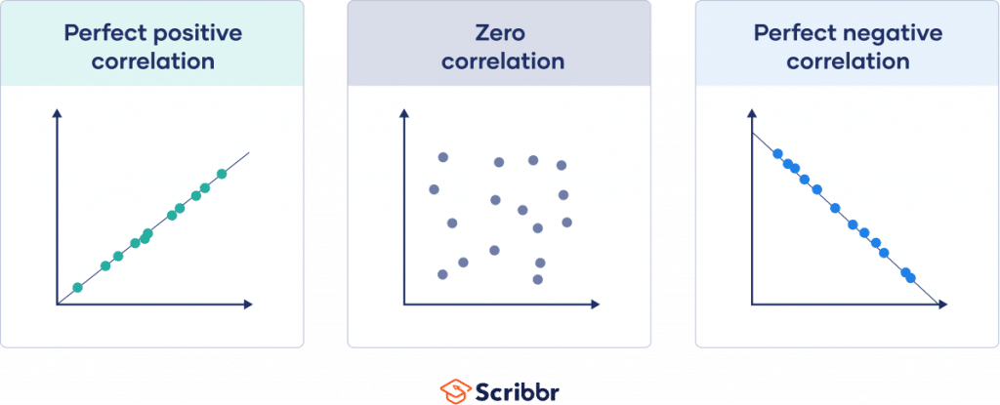
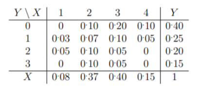

# 2. del

## 1. Pricakovana vrednost slucajne spremenljivke (matematicno upanje)

- `primer: npr. igralna kocka (3.5) ali binomska (np)`
  - $X\sim \begin{pmatrix}1 && 2 && 3 && 4 && 5 && 6 \\ \frac{1}{6} &&  \frac{1}{6} && \frac{1}{6} && \frac{1}{6} && \frac{1}{6} && \frac{1}{6}\end{pmatrix}$
  - $E(X)=\sum\limits_{i=1}^6 x_i \cdot p_i = 1\cdot \frac{1}{6}+2\cdot \frac{1}{6}+\cdots + 6\cdot \frac{1}{6}=3.5$

| Porazdelitev          | E(X)                |
| --------------------- | ------------------- |
| $B(p)$                | $p$                 |
| $B(n,p)$              | $np$                |
| $G(p)$                | $\frac{1}{p}$       |
| $P(n,p)$              | $\frac{n}{p}$       |
| $H(R,B,n)$            | $\frac{nR}{R+B}$    |
| $E([a,b])$            | $\frac{a+b}{2}$     |
| $P(\lambda)$          | $\lambda$           |
| $\text{Exp}(\lambda)$ | $\frac{1}{\lambda}$ |
| $\Gamma(n,\lambda)$   | $\frac{n}{\lambda}$ |
| $N(\mu, \sigma)$      | $\mu$               |
| $\chi^2(n)$           | $n$                 |

- `motivacija za definicijo (utezeno povprecje), tj. tezisce`
  - povprecje vrednosti diskretne spremenljivke (verjetnost \* vrednost)
  - predstavlja $\mu$ pri CLI
    $$E(X)=\sum\limits^n_{i=1}x_i \cdot p_i$$
- `definicija za diskretne slucajne spremenljivke (kdaj obstaja)`
  - diskretan slucjan spremenljivka je slucajna spremenljivka, ki ima stevno zalogo vrednosti
  - $E(X)=\sum\limits^n_{i=1}x_i \cdot p_i$
  - **pogoj** $\sum\limits^n_{i=1} |x_i| \cdot p_i < \infty$
- `definicija za zvezne slucajne spremenljivke (kdaj obstaja)`
  - zvezna slucajna spremenljivka je slucajna spremenljivaka ki lahko zavzameo katerkoli vrednost iz nekega intervala
  - $E(X) = \int\limits_{-\infty}^{\infty} x\cdot p_X(x) dx$
  - **pogoj**: $\int\limits_{-\infty}^{\infty} |x|p_X(x)dx < \infty$
- `primer slucajne spremenljivke za katero ne obstaja E(X)`
  - $X\sim p(x) = \frac{1}{\pi (1+x^2)}$ (Caucheyeva porazdelitev)
- `lastnosti: linearnost, z dokazom za homogenost`
  - **linearnost**: $E(aX+bY)=aE(x)+bE(Y)$
  - **homogenost**: $E(aX)=aE(X)$: dokaz:
    - E(X) je definirana kot povprecje diskretnih spremenljivk, ce vse to pomnozis s konstanto se mnozi tudi povprecje
    - homogenost in linearnost **integriranja** ter **vsote** (po definiciji)
- `Skica dokaz aditivnosti E(X+Y) = E(X)+E(Y) = ali Trditev 7.1: E(|XY|) ≤ √E(X2)E(Y 2)`
  - skripta str 90 // TODO

## 2. Disperzija (razprsenost oz. varianca) slucajne spremenljivke, odklon in standardizacija

- `primeri: npr. binomska (np(1 − p)), enakomerna (b − a)2/12`

| porazdelitev          | D(X)                                      |
| --------------------- | ----------------------------------------- |
| $B(p)$                | $p(1-p)$                                  |
| $B(n,p)$              | $np(1-p)$                                 |
| $G(p)$                | $\frac{1-p}{p^2}$                         |
| $P(n,p)$              | $\frac{n(1-p)}{p^2}$                      |
| $H(R,B,n)$            | $\frac{nRB\cdot (R+B-n)}{(R+B)^2(R+B-1)}$ |
| $P(\lambda)$          | $\lambda$                                 |
| $\text{Exp}(\lambda)$ | $\frac{1}{\lambda^2}$                     |
| $\Gamma(n,\lambda)$   | $\frac{n}{\lambda^2}$                     |
| $E([a,b])$            | $\frac{(b-a)^2}{12}$                      |
| $\chi^2(n)$           | $2n$                                      |

- `definicija s pricakovano vrednostjo in obstoj`
  - **Definicija**: $D(X) = E(X-E(X))^2=E(X^2)-E^2(X)$
  - $D(X)\geq 0$
  - **Pogoj**: nesme biti neskoncna
- `D(X) = 0 ⇐⇒ X je konstanta`
  - $D(X)=E(X-E(X))^2=E(X-X)^2=E(0)=0$
  - Torej ce je npr $P(X=a)=c$, Bo odklon vseh ostalih posameznih vzorcev od povprecja = 0;
- `lastnosti (aditivnost za neodvisni slucajni spremenljivki)`
  - Aditivnost disperzije: $D(X+Y)=D(X)+D(Y)+2 \text{Cov}(X,Y)$
    - ce sta X in Y neodvisni: $D(X+Y)=D(X)+D(Y)$
- `Standardizacija, slucajne spremenljivke in njena pricakovana vrednost oz. odklon`
  - Slucajno spremenljiko X **standardiziramo** s transformacijo
    $$X_s=\frac{X-\mu}{\sigma}$$
    - $E(X)=\mu$ in $D(X)=\sigma^2$
  - **Velja**:
    - $E(X_s)=E(\frac{X-\mu}{\sigma})=\frac{E(X-\mu)}{\sigma}=\frac{\mu-\mu}{\sigma}=0$
    - $D(X_s)=D(\frac{X-\mu}{\sigma})=\frac{D(X-\mu)}{\sigma^2}=\frac{\sigma^2+0}{\sigma^2}=1$
  - Standardizacija slucajne spremenljivke povzroci da vsaka spr. enako vpliva na pricakovano vrednost (npr. ce smo neke rezultate zmerili z razlicinimi merili, to nam pomaga za primerjavao razlicnih tipov spremenljivk)
- `Skica dokaza zveze “kosinusnu izrek”`
  - TODO

## 3. Korelacija in kovarianca

- `meri algebraicno povezanost dveh stevilskih slucajnih spremenljivk`
  - predstavlja mero povezanosti med dvema spremenljivkama
  

- `definicij korelacije in njen obstoj (CS E(|XY|) ≤ √E(X2)E(Y2))`
- `lastnosti korelacije`
  - $r(X,Y)=0\Leftrightarrow$ X in Y nekorelirani
  - $r(X,Y)=\pm 1 \Leftrightarrow$ X in Y sta v linearni zvezi
- `definicij korelacijskega koeficienta, vedno na [−1, 1]`
  - $r(X,Y)= \frac{\text{Cov}(X,Y)}{\sigma(X)\sigma(Y)}=\frac{E(XY)-E(X)E(Y)}{\sqrt{E(X^2)-E^2(X)}\cdot\sqrt{E(Y^2)-E^2(Y)}}$
- `kdaj lahko zakljucimo linearno odvisnost`
  - Dve slucajni spremenljivki sta **linearno odvisni** ce lahko eno zapisemo kot linearno funkcijo druge $\rightarrow$
    korelacijski koeficient med njima bo 1 ali -1.
- `Ali lahko izracunamo korelacijo iz disperzij (tj. D(X), D(Y) in D(X+Y))`
  - $D(X+Y)= D(X)+D(Y)+2\text{Cov}(X,Y)$
- `kovariancna matrika`
  - Naj bo X stolpicni vektor $X=(X_1,X_2,...X_n)^T$ (kjer so $X_i$ slucajne spremenljivke)
  - Potem definiramo kovariancno matriko $K_{XX}$, $(i,j)$ element je (kovarianca):
    - $K_{X_iX_j}=\text{cov}[X_i, X_j]= E[(X_i-E[X_i])(X_j-E[X_j])]$
- `povezava z regresijsko premico`
  - $K_{YX}K^{-1}_ {XX}$ je matrika regresijskih koeficientov

## 4. Slucajni vektorji 2D, 3D, nD

- `definicija slucajnega vektorja (primer)`
  - Slucajni vektor je n-terica slucajnih spremenljiv $X=(X_1,....,X_n)$
  - Primer slucajni vektor $(X_1, X_2)$:
    - $X_1$ stevilo metov ko pade sestica, pri 3 metih kocke
    - $X_2$ stevilo metov ko pade stevilo manjse od 3, pri 3 metih kocke
- `definicija porazdelitvene funkcije (primer)`
  - $F(x_1,x_2,...,x_n)=P(X_1 \leq x_1, \dots, X_n \leq  x_n)$
  - Primer za metanje kock
    - $F_{X,Y}(x,y)=P(X\leq x, Y\leq y)= \sum\limits_{i=1}^{\infty}\sum\limits_{j=1}^{\infty}p_{ij}\cdot 0/1$ (1 ce je i <= x in j <= y 0 sicer
  - Za zvezni vektor uporabimo integrale
    - $F_{X,Y}(x,y)=P(X\leq x, Y\leq y)=\int\limits^x_{-\infty}\int\limits^y_{-\infty}p_{X,Y}(x,y)dxdy$
- `verjetnostna in kontingencna tabela, verjetnostna funkcija (primer)`

  $$
  \begin{array}{c|ccc|c}
      X,Y & y_1 & \dots & y_m & X \\
      \hline
      x_1 & p_{11} & \dots & p_{1m} & p_1 \\
      \dots & \dots & \dots  & \dots & \dots \\
      x_n & p_{n1} & \dots & p_{nm} & p_n\\
      \hline
      Y & q_1 & \dots & q_m & 1
  \end{array}
  $$

- `gostota verjetnosti (primer)`
  - funkciji $p_{X,Y}$ pravimo (dvorazsezna) gostota verjetnosti (doloca vektor zveznih spremenlijvk)
  - npr: $p_{X,Y}(x,y)=\frac{1}{4}$ z zalogo vrednosti $x\in [0,2], y\in [0,2]$
- `robne porazdelitvene funkcije`
  - Funkciji $F_i(x_i)=F(\infty,\dots,\infty,x_i,\infty,\dots,\infty)$ pravimo **robna porazdelitvena funkcija** spremenljivke $X_i$
  - Npr za diskretne
    - $P(X=x_i)=\sum\limits_{j=1}^\infty p_{ij}$
    - $P(Y=y_i)=\sum\limits_{i=1}^{\infty}p_{ij}$
- `Ali se da iz verjetnostne funkcije slucajnega vektorja ugotoviti neodvisnost njegovih komponent?`
  - **DA**, npr za diskretni vektor:
    - $\forall x,y: P(X=x, Y=y)=P(X=x)P(Y=y)$
  - npr, za zvezni vektor
    - $\forall x,y, X\leq x \land Y\leq y: p_{X,Y}(x,y)=p_X(x)p_Y(y)$
- `zveza med gostoto verjetnosti in porazdelitveno funkcijo`
  - za dve spremenljivki (na n spremenljivk trivialen prehod):
    - $F_{X,Y}(x,y)=P(X\leq x, Y\leq y) = \int\limits^x_{-\infty}\int\limits^y_{-\infty}p_{X,Y}(x,y)dxdy$
- `definicija kvadranta in izpeljava formule pravokotnik`
  - Naj bo $A(x,y)=\{(u,v)\in \mathbb{R}^2: u\leq x \land v \leq y\}$ (levi spodnji kvadrant glede na (x,y))
  - Naj porazdelitvena funkcija opisuje verjetnost da je slucajna tocka (X,Y) v mnozici A(x,y)
    $$F(x,y)=p(X\leq x, Y\leq y)=P(X,Y)\in A(x,y)$$
  - Tedaj je verjetnost da je slucjana tocka (X,Y) v pravokotniku $(a,b]\times (c,d]$ enaka:
    $$P(X,Y)\in (a,b]\times (c,d]=F(b,d)-F(a,d)-F(b,c)+F(a,c)
- `neodvisnost`
  - $P(X=x)\cdot P(Y=y) = P(X=x,Y=Y)$

## 5. Polinomska porazdelitev

- TODO
- `primeri`
  - Imamo volitve z 3 izbirami (A,B,C). Kandidat A prejme 20% glasov, B 30%, C 50% glasov. Ce so glasovalci izbrani
    randomly, kaksna je verjetnost da bomo izmed 6 izbranih izbrali natanko enega volivca za kandidata A, dva za B in tri za C.
    $$X\sim P(6;0.2,0.3,0.5)$$
    $$P(A=1,B=2,C=3)=\frac{6!}{1!2!3!}(0.2^1)(0.3^2)(0.5^3)$$
- `zaloga vrednosti`
- `definicija`
- `verjetnostna funkcija (zapisi pi,j,...,k)`
  - Polinomska porazdelitev $\sim P(n;p_1,\dots,p_r)$
    - $\sum p_i = 1$, $\sum k_i = n$
    - spremenljivke $X_i$ opisujejo stevilo pojavitev rezultata i
  - $P(X_1=k_1, \dots, X_r=k_r)=\frac{n!}{k_1! \cdots k_r!}p_1^{k_1}\cdots p_r^{k_r}$
- `povezava z binomsko`
  - za r=1 dobimo binomsko porazdelitev B(n,p)=P(n;p,q)
- `pricakovana vrednost in disperzija`
  - $E(X_i)= np_i$
  - $D(X_i)=\sqrt{np_i(1-p_i)}$

## 6. Funkcije slucajnih spremenljivk

- `primeri enostavnih funkcij`
- `definicija in povezava med ustreznima porazdelitvenima funkcijama`
  - Naj bo X porazdeljena z gostoto p(x)
  - Novo slucajno spremenljivka Y dobimo tako, vse vrednosti v $Z_X$ preslikamo z g, torej:  
    $Y=g(X)$
  - $F_Y(y)=P(g(X)\leq y)$
- `zveza med gostatami verjetnosti`
  - $F_Y(y)=\int\limits_{-\infty}^{f^{-1}(y)} p(x) dx$ in ce je f odvedljiva $p_Y(y)=p(f^{-1}(y))f^{-1}(y)'$
- `formula za pricakovano vrednost`
  - diskretna:
    $$E(f(X))=\sum\limits^{\infty}_{k=0} f(x_k)\cdot p_k$$
  - zvezna
    $$E(f(X))=\int\limits^{\infty}_{-\infty} f(x)\cdot p_X(x) dx$$
- `neodvisnost`
  - Ce so $X_1,X_2,\dots, X_n$ neodvisne standardizirane normalne slucajne spremenljivke, je slucajna spremenljivka
    $Y=X_1^2+\cdots+X^2_n$ porazdeljena po $\chi^2(n)$
- `izpeljava zveze med N(0, 1) in χ2(1)`
  - zgoraj??

## 7. Funkcije slucajnih vektorjev

- `primer`
- `definicija`
  - Funkcija slucajnega vektorja je slucajni vektor.
- `definicija konvolucije`
  - Definiramo $Z=X+Y$, verjetnostna funkcija (diskretni)
    $$P(Z=z)=\sum\limits^\infty_{k=-\infty} P(X=k)P(Y=z-k)$$
  - za slucajni dobimo gostoto verjetnosti:
    $$p_Z(z)=\int\limits^\infty_{-\infty}f_{XY}(x,z-x)dx$$
    - ce sta neovidsni pa
      $$p_Z(z)=\int\limits^\infty_{-\infty}p_X(x)p_Y(z-x)dx$$
  - In tej formuli pravimo **konvolucija** slucajnih distribucij
- `uporaba za vsoto dveh neodvisnih normalnih porazdelitev`

  - $X\sim N(\mu_X, \sigma^2_X)$
  - $Y\sim N(\mu_Y, \sigma^2_Y)$
  - $Z = X + Y \rightarrow Z\sim N(\mu_X+\mu_Y, \sigma_X^2+\sigma_Y^2)$

- `uporaba za vsoto dveh neodvisnih Gama porazdelitev`
  - $X\sim \text{Gamma}(a, \theta)$, in $Y\sim \text{Gamma}(b,\theta)$ potem $X+Y\sim \text{Gamma}(a+b, \theta)$
- `formula za pricakovano vrednost produkta`
  - $E(XY)= E(E(XY | Y))$
  - ce sta neovidsni
    - $E(XY)=E(X)\cdot E(Y)$
- `Jacobijeva determinanta in prehod na nove spremenljivke`

## 8. Pogojna porazdelitev

- `primer za diskretni slucajni vektor`
  - Imamo porazdelitveno shemo. Zapisi pogojno verjetnostno porazdelitev slucajne spremenljivke X, glede na pogoj y=2
      

  - Verjetnost v vrstici pri y= 2, moramo deliti s $P(Y=2) = 0.2$
    $$X|y=2\sim \begin{pmatrix}1 & 2 & 3 & 4 \\ 0.25 & 0.5 & 0.25 & 0 \end{pmatrix}$$
- `definicija v diskretnem primeru in v zveznem primeru`
  - diskretni primer:
    - Naj bo B nek mogoc dogodek $P(B)>0$. Potem lahko vpeljemo **pogojno porazdelitveno funkcijo**:
      $$F(x|B)=P(X\leq x|B)=\frac{P(X\leq x,B)}{P(B)}$$
  - zvezni primer:
    - Postavimo $B=(y<Y\leq y+h)$ za $h>0$ in zahtevajmo $P(B)>0$
      $$F_X(x|B)=P(X\leq x |B)=\frac{P(X\leq x, y<Y \leq y+h)}{P(y\leq Y < y+h)}=\frac{F(x,y+h)-F(x,y)}{F_Y(y+h)-F_Y(y)}$$
- `pogojna porazdelitvena funkcija v obeh primerih`
  - diskretni primer:
    $$F_X(x|y_k)=F_X(x|Y=y_k)=P(X\leq x | Y = y_k)=\frac{P(X<x,Y=y_k)}{P(Y=y_k)}=\frac{1}{q_k}\sum\limits_{x_i\leq x} p_{ik}$$
  - zvezni primer:
    - ce obstaja limita za ($h\rightarrow 0$)
      $$F_X(x|y)=F_X(x|Y=y)=\lim\limits_{h\rightarrow 0}\frac{F(x,y+h)-F(x,y)}{F_Y(y+h)-F_Y(y)}$$
    - imenujemo jo pogojna porazdelitvena funkcija slucajne spremenljivke X glede na dogodek (Y=y)
- `izpeljava pogojne verjetnostne funkcija v diskretnem primeru`
  - Vpeljimo pogojno verjetnostno funkcijo $p_{i|k}=\frac{p_{ik}}{q_k}$. Tedaj je $F_X(x|y_k)=\sum\limits_{x_i\leq x}p_{i|k}$
- `izpeljava pogojne gostote v zveznem primeru`
  - Naj bosta gostoti $p(x,y)$ in $p_Y(y)> 0$ zvezni. Tedaj je:
    $$F*X(x|y)=\lim\limits*{h\rightarrow 0}\frac{\frac{F(x,y+h)-F(x,y)}{h}}{\frac{F*Y(y+h)-F_Y(y)}{h}}=\frac{\frac{\partial F}{\partial y}(x,y)}{F_Y'(y)}=\frac{1}{p_Y(y)}\int\limits^x*{-\infty}p(u,y)du
- `primer za zvezni slucajni vektor`

## 9. Momenti in kvantili

- Momenti pokazejo lastnosti vzorca - povprecno vrednost, razprsitev, asimetrijo in sploscenost
- `katere momente poznas`

  - **Zacetne** (merimo od 0)
    - Consider the following dataset [12 14 14 17 18]
    - Consider alternate dataset \[15 15 15 15 15\] (enak prvi moment)
    - Each item represents distance from 0
    - average distance from zero: $\frac{\Sigma x_i}{n}\rightarrow$ **prvi moment** = $\mu_1=15$ predstavlja **povprecje**
    - average square distance fom zero : $\frac{\Sigma x_i^2}{n}\rightarrow$ **drugi moment** = $\mu_2=229.8$ (alternate data set ima $\mu_2 =225$)
    - $\frac{\Sigma x_i^3}{n}$ **tretji moment**
    - $\frac{\Sigma x_i^4}{n}$ **cetrti moment**
  - **Centralne** (merimo od sredine)
    - average square distance from povprecna vrednost $\frac{\Sigma(x_i-\mu_1)^2}{n}\rightarrow$ **centriran drugi moment** predstavljka varianco $\sigma^2$
    - $\frac{\Sigma(x_i-\mu_1)^3}{n}\rightarrow$ **centriran tretji moment** (asimetrija skewness)
    - $\frac{\Sigma(x_i-\mu_1)^4}{n}\rightarrow$ **centriran cetrti moment** (sploscenost, kurtosis)
  - **Standardizirane**
    - $\frac{1}{n}\frac{\Sigma(x-\mu)^3}{\sigma^3}$ (standardizeran tretji moment)
    - $\frac{1}{n}\frac{\Sigma(x-\mu)^4}{\sigma^3}$ (standardizeran cetrti moment)

- `definicija momenta reda k glede na tocko a`
  - $m_k(a)=E((X-a)^k)$
  - Moment obstaja, ce obstaja pricakovana vrednost $E(|X-a|^k) < \infty$
- `zacetni moment, centralni moment`
  - zacetni moment ko je a =0
  - centralni moment ko je a = povprecna vrednost
- `lastnosti`
  - Ce obstaja centralni moment reda n, potem obstaja vsi momenti reda k, $k\leq n$
  - Ce obstaja zacetni moment reda n, potem obstajaju tudi centralni momenti reda n za $\forall a \in \mathbb{R}$
- `definicija kvantila`
  - Kadar spremenljivka nima momentov uporabimo kvantile.
  - Kvantili so "linije" ki razdelijo podatke v skupine enake velikosti
  - Mediana je drugi kvantil (ker polovica podatkov manse polovica vecje)
  - Percentili so kvantili ki delijo podatke v 100 skupine enake velikosti
- `povezava z inverzom porazdelitvene funkcije`
  - TODO

## 10. Studentova porazdelitev

- `Kako lahko pridemo do te porazdelitve, primer`
- `zaloga vrednosti`
- `kaj predstavlja njen paramter`
- `predpostavke`
- `gostota verjetnosti`
- `definicja beta funkcije`
- `posebne vrednosti beta funkcije`
- `katero porazdelitev dobimo za eno prostostno stopnjo in katero, ce je stivlo prosotstnih stopenj dovolj veliko`

## 11. Fisherjeva porazdelitev

- `kako lahko pridemo do te porazdelitve priemr`
- `zaloga vrednosti`
- `kaj predstavljajo njeni parametri`
- `predpostavke`
- `definicija - verjetnostna funkcija`
- `definicija beta funkcije`
- `posebne vrednosti beta funkcije`
- `primer statistike, ki se porazdeljuje po Fisherjevo`
- `se kaksne lastnosti fisherjeve porazdelitve`
