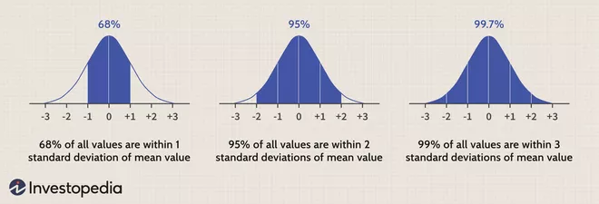

# 3. del

## 1. Vzorcenje in cenilke

- `Definicija enostavnega slucajnega vzorca`
  - Recimo da merimo spremenljivko X, tako da n-krat nakljucno izberemo neko enoto in na njej izmerimo vrednost spremenljivke X.
    Postopku usterza slucajni vektor
    $$(X_1,\dots,X_n)$$
    vrednostim meritem $(x_1,...x_n)$ pa recemo **vzorec**. Stevilo n je velikost vzorca. Ker v vzorcu merimo isto
    spremenljivko in posamezna meritev ne sme vplivate na ostale lahko predpostavimo:
    - vsi cleni $X_i$ vektorja imajo isto porazdelitev, kot spremenljivka X
    - cleni vektorja $X_i$ so med seboj neodvisni
  - Takemu vzorcu recemo **enostavni slucajni vzorec**. Ce je populacija koncna lahko dobimo enostavni slucajni vzorec
    tako, da slucajno izbiramo (z vracanjem) enote z enako verjetnostjo.
- `Vzorcne sredinske mere (modus, mediana, povprecje)`
  - **vzorcni modus** je najpogostejsa vrednost
  - **vzorcna mediana** je srednja vrednost glede na urejenost
    $$M_e = \left\{ \begin{array}{lr} Y_{n+1}/2 & ,n - \text{ liho} \\ \frac{Y_{n/2}+Y_{n/2+1}}{2} &,n - \text{ sodo} \end{array} \right\}$$
  - **vzorcno povprecje** je povprecna vrednost
    $$\overline{X}=\frac{1}{n}\sum\limits^n_{i=1}X_i$$
- `Vzorcne mere razprsenosti (razmik, varianca, standardni odklon)`
  - **vzorcni razmah/razmik**: $\max\limits_i x_i - \min\limits_i x_i$
  - **Vzorcna disperzija**: $s^2_0 = \frac{1}{n} \sum\limits_{i=1}^n (x_i-\overline{x})^2$
  - **Popravljen vzorcna disperzija** $s^2 = \frac{1}{n-1} \sum\limits_{i=1}^n (x_i-\overline{x})^2$
  - **vzorcna odklona**: $s_0$ in s
- `Vzorcne mere oblike porazdelitve (koeficienta asimetrije in sploscenosti)`
  - **koeficient asimetrije** (s centralnimi momenti): $g_1 = \frac{m_3}{m_2^{3/2}}$
  - **koeficient sploscenosti** (s centralnimi momenti): $K=g_2=\frac{m_4}{m_2^2-3}$
- `Definicija cenilke`
  > cenilka je pravilo ali formula, ki nam pove, kako izracunati numericno oceno parametra populacije na osnovi merjenj vzorca.
  - **Cenilka** parametra $\zeta$ je vzorcna statistika $C=C(X_1,\dots,X_n)$, katere porazdelitveni zakon je odvisen
    le od parametra $\zeta$, njene vrednosti pa lezijo v prostoru parametrov. SEveda je odvisna tudi od velikosti vzorca n.
  - Primer: Vzorcna mediana $\tilde{X}$ in vzorcno povprecje $\overline{X}$ sta cenilki za populacijsko povprecje
    $\mu$; popravljena vzorcna disperzija $S^2$ pa je cenilka za populacijsko disperzijo $\sigma^2$
- `Vpelji nepristranskost in doslednost cenilke`
  - Cenilka $C_n$ parametra $\zeta$ je **nepristranska**, ce je $E(C_n)=\zeta, \forall n$
  - Cenilka C parametra $\zeta$ je **dosledna** ce z rastocim n zaporedje $C_n$ verjetnostno konvergira k parametru
    $\zeta$, tj. za vsak $\epsilon > 0$, velja
    $$\lim\limits_{n\rightarrow \infty} P(|C_n - \zeta)< \epsilon) = 1$$
- `CLI`

## 2. CLI za $\overline{X}$

**Vzorcno povprecje normalno porazdeljenga vzorca**. Naj bo $(X_1, X_2,\dots X_n)$ normlano porazdeljen enostavni slucajni
vzorec, $X_i \sim N(\mu,\sigma)$. Potem je porazdelitev vzorcnega povprecja $\overline{X}=\frac{1}{n}\sum\limits_{i=1}^n X_i$ tudi normalna.
$$\overline{X}\sim N(\mu, \frac{\sigma}{\sqrt{n}})$$

**CLI za vzorcno povprecje**. Naj bo $(X_1,\dots, X_n)$ slucajni vzorec in $E(X_i)=\mu$ ter $D(X_i)=\sigma^2 < \infty$, potem
za dovolj velik vzorec $n\geq 30$:
$$\overline{X}\sim N(\mu, \frac{\sigma}{\sqrt{n}})$$

## 3. CLI za delez

**Interval zaupanja za delez p**: Naj bo p delez populacije z doloceno lastnostjo in naj bo $(X_1,\dots, X_n)$ enostavni slucajni
vzorec, pri cemer $X_i=1$ z verjetnostjo p in $X_i$ = 0 z verjetnostjo $1-p$.

Neznani delez p ocenjujemo z vzorcnim delezom $\hat{p}=\frac{1}{n}\sum\limits_{i=1}^n X_i$. Interval zaupanja za delez
p s stopnjo zaupanja $1-\alpha$ je enak
$$I_p = \left[\hat{p}-c\sqrt{\frac{\hat{p}(1-\hat{p})}{n}} , \hat{p}+c\sqrt{\frac{\hat{p}(1-\hat{p})}{n}}\right]$$
kjer je $c=F^{-1}(1-\frac{\alpha}{2})$ kvantil standardne normalne porazdelitve.

Za uporabo zgornjega izraza za interval zaupanja za p potrebujemo dovolj veliki vzorec, za aproksimacijo porazdelitve vzorcnega
deleza z normalno porazdelitvijo.

## 4. CLI za $S^2$

Naj bo slucajna spremenljivka X na neki populaciji porazdeljena normalno tj. $N(\mu, \sigma)$
Za dovolj velike n je:

- vzorcna disperzija $S^2_0$ prblizno $N(\frac{(n-1)\sigma^2}{n},\frac{\sigma^2\sqrt{2(n-1)}}{n})$
- popravljena vzorcna disperzija $S^2$ priblizno $N(\sigma^2, \sigma^2 \sqrt{\frac{2}{n-1}})$

## 5. CLI za razliko vzorcnih povprecij

Denimo da imamo dve populaciji velikosti $N_1$ in $N_2$ in se spremenljivka X na prvi populaciji porazdeljuje noralno $N(\mu_1,\sigma)$
na drugi populaciji pa $N(\mu_2,\sigma)$ (standardna odklona sta na obeh populacijah enaka). V vsaki od obeh populacij
tvorimo neodvisno slucajne vzorce velikosti $n_1$ in $n_2$. Na vsakem vzorcu (s ponavljanjem) prve populacije izracunamo
vzorcno povprecje $\overline{X}_ 1$ in podobno na vsakem vzorcu druge populacije $\overline{X}_ 2$. Po reprodukcijski
lastnosti normalne porazdelitve je porazdelitev velikih vzorcnih povprecij normlana kjer je:

- **pricakovana vrednost razlik** vzorcnih povprecij enako
  $$E(\overline{X}_1-\overline{X}_2)=E(\overline{X}_1)-E(\overline{X}_2)=\mu_1 - \mu_2$$
- **disperzija razlik vzorcnih povprecij** enaka:
  $$D(\overline{X}_1-\overline{X}_2)=D(\overline{X}_1)+D(\overline{X}_2)=\frac{\sigma^2}{n_1}+\frac{\sigma^2}{n_2}$$

## 6. CLI za razliko delezev

Podobno kot pri porazdelitvi razlik vzorcnih povprecij naj bosta dani dve populaciji velikosti $N_1$ in $N_2$ z delezema
enot z neko lastnostjo $\pi_1$ in $\pi_2$. Iz prve populacije tvorimo slucajne vzorce velikosti $n_1$ in na vsakem izracunamo delez
enot s to lastnostjo $p_1$. Podobno naredimo tudi na drugi populaciji; tvorimo slucajne vzorce velikosti $n_2$ in na
njih dolocimo deleze $p_2$.

Pokazati se da, da se za dovolj velike vzorce razlike vzorcnih delezev porazdeljujejo priblizno normalno s

- pricakovano vrednostjo razlik vzorcnih delezev
  $$E(\hat{P_1}-\hat{P_2})=E(\hat{P_1})-E(\hat{P_2})=\pi_1 - \pi_2$$
- disperzijo razlik vzorcnih delezev
  $$D(\hat{P_1}-\hat{P_2})=D(\hat{P_1})+D(\hat{P_2})=\frac{\pi_1(1-\pi_1)}{n_1}+\frac{\pi_2(1-\pi_2)}{n_2}$$

## 7. CLI za kvocient $S^2_1/ S^2_2$

- TODO

- `Kako zacnemo (kaj nas pravzaprav zanima)?`
- `predpostavke`
- `izbira vzorca`
- `slucajni vektor, ki spremlja nakljucno izbran vzorec`
- `izbira cenilke`
- `izrek, ki nam zagotovi normalno porazdelitev`
- `parameter μ te normalne porazdelitve`
- `parameter σ te normalne porazdelitve`
- `kaj je pomembno pri drugem parametru`
- `uporaba`

## 8. Intervali zaupanja

- `definicija tockovne ocene za parameter, primeri (vsaj 3)`
  - Naj bo $\theta$ neznani parameter porazdelitve slucajne spremenljivke X in $(X_1,X_2,\dots, X_n)$ enostavni slucajni
    vzorec. Iscemo interval vrednosti, v katerem se, z veliko verjetnostjo nahaja neznani parameter $\theta$. Na
    osnovi vzorca se definirata statistiki (funkciji vzorca) L in U tako da velja $P(L\leq \theta \leq U)=1-\alpha$.
    Potem recemo, da je $I\theta=[L,U]$ interval zaupanja za neznani parameter $\theta$ s stopnjo zaupanja $1-\alpha$. Stevilo se
    imenuje stopnja tveganja.
- `pomen stopnje zaupanja`
  - **stopnja zaupanja**: obicajno med 95% in 99%, verjetnost, da se bo parameter v mnozici neodvisnih poskusov
    znasel na intervalu. Vzemimo stopnjo tveganja $\alpha=0.05$. Denimo da smo zbrali 100 slucajnih vzorcev in
    za vsakega izracunali interval zaupanja za parameter $\gamma$. Tedaj lahko pricakujemo, da 5 intervalov zaupanja od
    100 ne bo pokrilo iskanega parametera $\gamma$.
    $$\text{stopnja tveganja}=1-\text{stopnja zaupanja}
- `postopek intervalskega ocenjevanja`
  - Najprej dolocimo stopnjo zaupanja in nato uporabimo formulo za iskani parameter in na podlagi njega dolocimo stopnjo in zgornjo mejo intervala.
- `kdaj uporabimo Studentovo porazdelitev`
  - Iskanje pricakovane vrednosti, ko ni podana varianca
- `kaj je drugace, ko imamo majhen vzorec`
  - Prevzeti moramo, da je vzorec iz priblizno normalno porazdlejene populacije
- `izbira velikosti vzorca`
  - vsaj 25
- `izpeljava formule za interval zaupanja`
  - TODO

## 9. Preverjanje domnev

- `Definicije (H0 in H1, testna statistika, α in β, kriticno obmocje)`
- `Opis formalnega postopka`
- `Definiraj moc testa`
- `Pregled enostavnih statisticnih testov`
- `Vpelji P -vrednost in podaj primer racunanja te vrednosti`
- `Opisi postopek preverjanje domneve o porazdelitvi slucajne spremenljivke`

## 10. Bivariatna analiza in regresija

- TODO
- `preverjanje povezanosti slucajnih spremenljivk (glede na tip slucajnih spremenljivk)`
  - Mere povezanosti locimo glede na tip spremenljivk:
    1. IMENSKI/NOMINALNI tip para spremenljivk (ena od spremenljik je imenska/nominalna) $\chi^2$ test, kontinguencni koeficienti, koeficineti asociacije
    1. ORDINALNI tip para spremenljivk (ena spremenljivka je ordinalna druga ordinalna ali boljsa) **koeficient korelacije rangov**
    1. STEVILSKI tip para spremenljivk (spremenljivki sta stevilski): **koeficient korelacije**
- `preverjanje neodvisnosti imenskih slucajnih spremenljivk`
- `koeficient korelacije (Pearsonov, Spearmanov), preverjanje domneve o parametru ρ`
  - **Pearsonov koeficient**: $\phi=\chi^2/n$, ki ima zgornjo mejo $\phi_{\text{max}}^2=k-1$
  - \_\_
- `linearna regresija (definicije, predpostavke, metoda najmanjsih kvadratov)`
  - The goal of simple linear regression is to create a linear model that minimizes the sum of squares of the residuals / error (SSE)
- `casovne vrste in definicija trenda`
- `Staticni test linearnosti mo`
