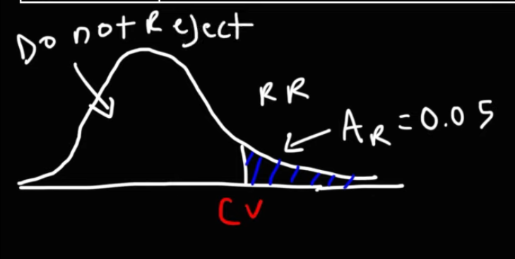
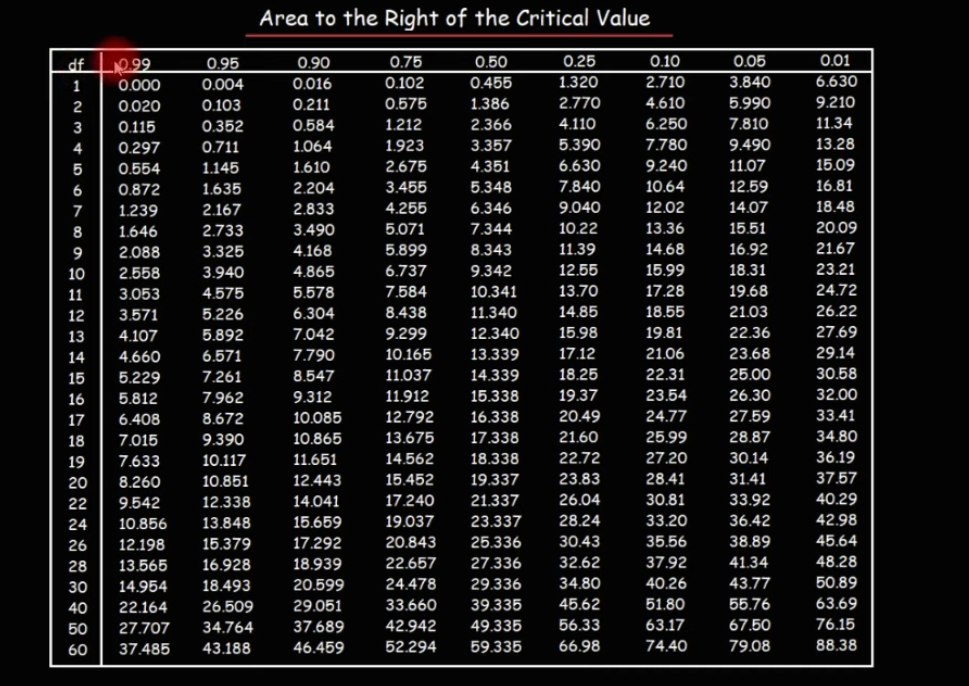
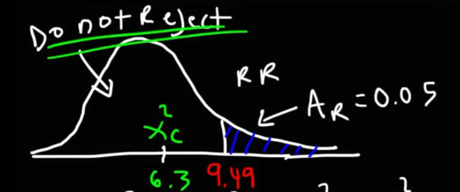
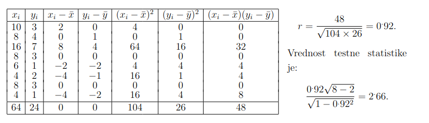

# 3. del

## 1. Vzorcenje in cenilke

- `Definicija enostavnega slucajnega vzorca`
  - Naj bo X slucajna spremenljivka. **Enostavni slucajni vzorec** je slucajni vektor $(X_1, X_2,\dots, X_n)$ z vrednostmi meritev $(x_1, \dots, x_n)$ (n = velikost vzorca) za katerega velja:
    1.  vsi cleni vektorja $X_i$ imajo **enako porazdelitev** kot spremenljivka X
    1.  cleni $X_i$ so med seboj **neodvisni**
- `Vzorcna statistika`
    - __poljubna simetricna funkcija vzorca__ (njena vrednost je neodvisna od permutacij argumentov) 
        $$Y=g(X_1, X_2, \dots, X_n)$$
    - Vzorcna statistika je __slucajna spremenljivka__. Znacilni vrednosti:
        - pricakovana vrednost $E(Y)$, za katero uporabljamo vzorcno povprecje
        - standardni odklon $\sigma_Y$ (pravimo tudi standardna napaka statistike $\text{SE}(Y)$), za katerega upostevamo vzorcni odklon
- `Vzorcne sredinske mere (modus, mediana, povprecje)`
  - **vzorcni modus** je najpogostejsa vrednost
  - **vzorcna mediana** je srednja vrednost glede na urejenost
    $$M_e = \left\{ \begin{array}{lr} Y_{n+1}/2 & ,n - \text{ liho} \\ \frac{Y_{n/2}+Y_{n/2+1}}{2} &,n - \text{ sodo} \end{array} \right\}$$
  - **vzorcno povprecje** je povprecna vrednost
    $$\overline{X}=\frac{1}{n}\sum\limits^n_{i=1}X_i$$
- `Vzorcne mere razprsenosti (razmik, varianca, standardni odklon)`
  - **vzorcni razmah/razmik**: $\max\limits_i x_i - \min\limits_i x_i$
  - **Vzorcna disperzija**: $s^2_0 = \frac{1}{n} \sum\limits_{i=1}^n (x_i-\overline{x})^2$
  - **Popravljen vzorcna disperzija** $s^2 = \frac{1}{n-1} \sum\limits_{i=1}^n (x_i-\overline{x})^2$ uporabimo jo ko je vzorec majhen
  - **vzorcna odklona**: $s_0$ in s
- `Vzorcne mere oblike porazdelitve (koeficienta asimetrije in sploscenosti)`
  - **koeficient asimetrije** (s centralnimi momenti): $g_1 = \frac{m_3}{m_2^{3/2}}$
  - **koeficient sploscenosti** (s centralnimi momenti): $K=g_2=\frac{m_4}{m_2^2} - 3$
    - $K=0$ ~ normalna porzadelitev zvonaste oblike
    - $K<0$ ~ bolj kopasta kot normalna porazdelitev, s krajsimi repi
    - $K>0$ ~ bolj spicasta kot normalna porazdelitev, s daljsimi repi 
- `Definicija cenilke`
  > cenilka je pravilo ali formula, ki nam pove, kako izracunati numericno oceno parametra populacije na osnovi merjenj vzorca.
  - **Cenilka** parametra $\zeta$ je __vzorcna statistika__ $C=C(X_1,\dots,X_n)$, katere porazdelitveni zakon je odvisen
    le od parametra $\zeta$, njene vrednosti pa lezijo v prostoru parametrov. Seveda je odvisna tudi od velikosti vzorca n.
    |Parameter | Cenilka $f(X_1,X_2,\dots, X_n)$ | Ocena $f(x_1,x_2,\dots, x_n)$|
    | - | - | - |
    | Pricakovana vrednost $\mu$ | $\overline{X}=\frac{1}{n} \sum\limits_{i=1}^n X_i$ | $\overline{x}=\frac{1}{n} \sum\limits_{i=1}^n x_i$ |
    | Standardni odklon $\sigma$ | $S=\sqrt{\frac{1}{n-1}\sum\limits_{i=1}^n(X_i-\overline{X})^2}$ | $s=\sqrt{\frac{1}{n-1}\sum\limits_{i=1}^n (x_i-\overline{x})^2}$
    | Verjetnost $p$ | $\overline{X}=\frac{1}{n} \sum\limits_{i=1}^n X_i$ | $\overline{x}=\frac{1}{n}\sum\limits_{i=1}^n x_i$ |
- `Vpelji nepristranskost in doslednost cenilke`
  - Cenilka $C_n$ parametra $\zeta$ je **nepristranska**, ce je $E(C_n)=\zeta, \forall n$ in je asimpoticno nepristranska, ce je $\lim_{n \rightarrow \infty} E(C_n) = \zeta$
  - Cenilka $C_n$ parametra $\zeta$ je **dosledna** ce z rastocim n zaporedje $C_n$ verjetnostno konvergira k parametru
    $\zeta$, tj. za vsak $\epsilon > 0$, velja
    $$\lim\limits_{n\rightarrow \infty} P(|C_n - \zeta)< \epsilon) = 1$$
- `CLI`
  - Naj bo $(X_1, X_2, \dots, X_n)$ normlano porazdeljen enostavni slucajni vzorec.
    - $X_i \sim N(\mu, \sigma)$
    $$\sum\limits_{i=1}^n X_i \sim N(n\mu, \sigma \sqrt{n})$$

## 2. CLI za $\overline{X}$
- `teorija`

    - Denimo da se spremenljivka X na populaciji porazdeljuje normalno $N(\mu, \sigma)$. Na vsakem vzorcu (s ponavljanjem)
    izracunamo vzorcno povprecje $\overline{X}$. Po reprodukcijski lastnosti normalne porazdelitve je __porazdelitev vzorcnih 
povprecij normalna__ kjer je:
        $$E(\overline{X})=E(\dfrac{\sum X_i}{n}) = \dfrac{1}{n} \sum E(X_i)= \dfrac{\sum E(X_i)}{n}=\dfrac{\sum \mu}{n}=\mu$$
        $$\text{SE}(\overline{X})=D(\overline{X})=\dfrac{1}{n^2} \sum_{i=1}^n D(Xi)=\dfrac{D(x)}{n}=\frac{\sigma}{\sqrt{n}}$$

    - __Kaj pa ce porazdelitev X ni normalna?__. Pri vecjih vzorcih (n>30), lahko uporabimo centralni limitni izrek, ki 
    zagotavlja, da je spremenljivka $\overline{X}$ porazdeljena standardizirano normalno. Vzorcno povprecje ima tedaj porazdelitev priblizno
    $$\overline{X}\sim N(\mu, \frac{\sigma}{\sqrt{n}})$$

- `primer`
    - Koliksna je verjetnost, da bo pri 36 metih igralne kocke povprecno stevilo pik vecje ali enako 4? X je slucajna 
    spremenljivka z vrednostmi 1,2,3,4,5,6 in verjetnostmi $1/6$. Zanjo je $\mu=3.5$ in $\sigma=1.7$. Vseh 36 ponovitev 
    meta lahko obravnavamo kot slucajni vzorec velikosti 36.
    $$P(\overline{X}\geq 4)=1-\phi\left(\frac{E(\overline{X})-\mu}{\frac{\sigma}{\sqrt{n}}}\right)=1-\phi\left(\frac{4-3.5}{\frac{1.7}{6}}\right)\approx 0.04$$

## 3. CLI za delez
- `izrek`

    - Denimo, da __zelimo na populaciji oceniti delez enot $\pi$ z doloceno lastnostjo__. V ta namen poiscemo vzorcni delez p.
    <u>Pokazati se da, da se za dovolj velike slucajne vzorce s ponavljanjem (za deleze okoli 0.5 je dovolj 20 enot ali vec), vzorcni delezi poradeljujejo priblizno normalno s</u>
    $$E(\hat{P})=\pi$$
    $$\text{SE}(\hat{P})=\sqrt{\frac{\pi(1-\pi)}{n}}$$
    $$\hat{P}\sim N(\pi, \sqrt{\frac{\pi (1-\pi)}{n}})$$

    - Za manjse vzorce (n<20) se vzorcni delez porazdeljuje `binomsko`. Mimogrede, cenilka populacijskega deleza je nepristranska
    ker velja $E(\hat{P})=\pi$
    $$\hat{P}\sim B(\pi, \sqrt{\frac{\pi(1-\pi)}{n}})$$
    - cenilka za delez $\pi$
        - $\hat{P}=\frac{\sum X_i}{n}=\overline{X}$

- `primer`

    - V izbrani populaciji je polovica zensk $\pi = 0.5$. Ce tvorimo vzorce po n = 25 enot, nas zanima, koliksna je 
    verjetnost, da je v vzorcu vec kot 55% zensk? To pomeni da iscemo verjetnost $P(p>0.55)$.
    Uporabimo dejstvo da se vzorcni delezi p porazdeljujejo priblizno normalno
    $$\hat{P} \approx N(0.5, \sqrt{\frac{0.5\cdot 0.5}{25}})=N(0.5,0.1)$$
    - Zato je
    $$P(\hat{P}> 0.55) = 1-\phi(\frac{0.55-0.5}{0.1})\approx 0.31$$
    - Torej pri priblizno 31% vzorcih zensk bo delez zensk vecji od 55%.

## 4. CLI za $S^2$
- Naj bo slucajna spremenljivka X na neki populaciji porazdeljena normalno $N(\mu, \sigma)$.
Kako bi dolocili porazdelitev za vzorcno disperzijo ali popravljeno vzorcno disperzijo tj.:
$$S_0^2 = \frac{1}{n} \sum\limits_{i=1}^n (X_i-\overline{X})^2 \text{ oziroma } S^2=\frac{1}{n-1} \sum\limits_{i=1}^n (X_i-\overline{X})^2$$

- <u>Dobimo ju iz vzorcne statistike</u> $\chi^2$:
$$\chi^2 = \frac{nS_0^2}{\sigma^2}=\frac{(n-1)S^2}{\sigma^2}=\frac{1}{\sigma^2}\sum\limits_{i=1}^n (X_i-\overline{X})^2$$
- Ker vemo, da je $E(\chi^2(n))=n$  in $D(\chi^2(n))=2n$ lahko takoj izracunamo:
    - $E(S_0^2)=E(\frac{\sigma^2\chi^2}{n})=\frac{(n-1)\sigma^2}{n}$, $E(S^2)=E(\frac{\sigma^2 \chi^2}{n-1})=\sigma^2$
    - $D(S_0^2)=D(\frac{\sigma^2\chi^2}{n})=\frac{2(n-1)\sigma^4}{n^2}$, $D(S^2)=D(\frac{\sigma^2\chi^2}{n-1})=\frac{2\sigma^4}{n-1}$

- Torej za dovolj velike n je:
$$\chi^2 \approx N(n-1, \sqrt{2(n-1)})$$
$$S_0^2 \approx N(\frac{(n-1)\sigma^2}{n}, \frac{\sigma^2\sqrt{2(n-1)}}{n})$$
$$S^2 \approx N(\sigma^2, \sigma^2 \sqrt{\frac{2}{n-1}})$$

## 5. CLI za razliko vzorcnih povprecij
- `definicija`

    - Denimo da imamo dve populaciji velikosti $N_1$ in $N_2$ in se spremenljivka X na prvi populaciji porazdeljuje noralno $N(\mu_1,\sigma)$
    na drugi populaciji pa $N(\mu_2,\sigma)$ (standardna odklona sta na obeh populacijah enaka). V vsaki od obeh populacij
    tvorimo neodvisno slucajne vzorce velikosti $n_1$ in $n_2$. Na vsakem vzorcu (s ponavljanjem) prve populacije izracunamo
    vzorcno povprecje $\overline{X}_ 1$ in podobno na vsakem vzorcu druge populacije $\overline{X}_ 2$. Po reprodukcijski
    lastnosti normalne porazdelitve __je porazdelitev velikih vzorcnih povprecij normalna__ kjer je:
$$E(\overline{X}_ 1-\overline{X}_ 2)=E(\overline{X}_ 1)-E(\overline{X}_ 2)=\mu_1 - \mu_2$$
$$D(\overline{X}_ 1-\overline{X}_ 2)=D(\overline{X}_ 1)+D(\overline{X}_ 2)=\frac{\sigma^2}{n_1}+\frac{\sigma^2}{n_2}$$
$$\overline{X}_ 1 - \overline{X_2} \approx N\left(\mu_1 - \mu_2, \sqrt{\frac{\sigma^2}{n_1}+\frac{\sigma^2}{n_2}}\right)$$

- `Primer`

    - Populacijama studentov na neki univerzi (tehnikom in druzboslovcem) so izmerili neko sposobnost s priackovanima
    vrednostima $\mu_t = 70$ ter $\mu_d=80$ tock in standardnim odklonom, ki je na obeh populacijah enak $\sigma=7$ tock.

    - Koliksna je verjetnost, da je pri nakljucnih vzorcih vzorcno povprecje druzboslovcev $(n_d=36)$ vezje za vec kot 
    12 tock od vzorcnega povprecja tehnikov ($n_t=64$)? Zanima nas torej verjetnost:
$$P(\overline{X}_ d - \overline{X}_ t>12)=1-\phi\left(\frac{12-10}{7\cdot \sqrt{\frac{36+64}{36\cdot 64}}}\right)=1-\phi(1.37)=0.085$$

## 6. CLI za razliko delezev
- `definicija`
    - Podobno kot pri porazdelitvi razlik vzorcnih povprecij naj bosta dani dve populaciji velikosti $N_1$ in $N_2$ z delezema
    enot z neko lastnostjo $\pi_1$ in $\pi_2$. Iz prve populacije tvorimo slucajne vzorce velikosti $n_1$ in na vsakem izracunamo delez
    enot s to lastnostjo $p_1$. Podobno naredimo tudi na drugi populaciji; tvorimo slucajne vzorce velikosti $n_2$ in na
    njih dolocimo deleze $p_2$.

    - Pokazati se da, __da se za dovolj velike vzorce razlike vzorcnih delezev porazdeljujejo priblizno normalno s__
    $$E(\hat{P_1}-\hat{P_2})=E(\hat{P_1})-E(\hat{P_2})=\pi_1 - \pi_2$$
    $$D(\hat{P_1}-\hat{P_2})=D(\hat{P_1})+D(\hat{P_2})=\frac{\pi_1(1-\pi_1)}{n_1}+\frac{\pi_2(1-\pi_2)}{n_2}$$
$$\hat{P}_ 1 - \hat{P}_ 2 \approx N\left(\pi_1 - \pi_2, \sqrt{\frac{\pi_1(1-\pi_1)}{n_1} + \frac{\pi_2(1-\pi_2)}{n_2}}\right)$$

## 7. CLI za kvocient $S^2_1/ S^2_2$
- `uvod`
    - Zelimo primerjati varianci teze prebivalcev dveh razlicnih populacij. Naj bo X teza odraslih moskih iz prve populacije,
    ter Y teza odraslih moskih iz druge populaciji. Nimamo moznosti da izmerimo tezo celotne prve in druge populacije, 
    zato bomo izbrali enostavni slucajni vzorec iz vsake od populacij in jim izmerimo tezo. Slucajni spremenljivki X in Y sta 
    neodvisni. Obe sta porazdeljeni normalno $X\sim N(\mu_1, \sigma_1)$, $Y\sim N(\mu_2, \sigma_2)$. Na njih tvorimo slucajne 
    vzorce $(X_1, \dots ,X_n)$ in $(Y_1, \dots, Y_m)$ ter izracunamo vzorcni povprecji in popravljeni vzorcni varianci za 
    obe spremenljivke. Nastavimo vzorcno statistiko za kvocient obe popravljeni vzorcni varianci:
    $$F=\frac{s_1^2}{s_2^2}$$
- `fisherjeva porazdelitev`
    - porazdelitev $F=\frac{S_X^2/ \sigma_X^2}{S_Y^2/ \sigma_Y^2}$ je __fisherjeva__ $F(n-1, m-1)$
        - kjer sta parametra prostostne stopnje obeh vzorcev
porazdeljeni po $\chi^2$ z m-1 oziroma n-1 prostostnimi stopnjami in sta tudi neodvisni.
        - $\chi^2(m-1)=(m-1) s^2_X / \sigma_X^2$

- `parameter μ te normalne porazdelitve`
    - $\mu$ = $\frac{d_2}{d_2-2}$
- `parameter σ te normalne porazdelitve`
    - $\sigma=\frac{2d_2^2 (d_1+d_2-2)}{d_1(d_2-2)^2(d_2-4)}$
- `uporaba`
    - Uporabljamo pri intervalu zuapanja in statisticnemu testu za kvocient populacijskih varianc $\dfrac{\sigma_1^2}{\sigma_2^2}$
- `primer`
    
    Zelimo prijemjati varianci teze prebivalcev dveh mest. $X$ je teza odraslih moskih enega mesta in $Y$ je teza odraslih moskih drugega mesta. Ker ne moramo izmeriti teze celotni populaciji si izberemo slucajni vzorec iz vsake od populacij in izmerimo njuno tezo. Slucajni spremenljivki sta neodvisni, obe porazdeljeni normalno.
    Na njih tvorimo slucjane vzorce $(X_1, \dots, X_m)$ in $(Y_1, \dots, Y_m)$  ter izracunamo vzorcni povprecji in popravljeni vzorcni varianci za obe spremenljivki. Kvoceiwnt varianc ocenujemo s kvocientom popravljenih vzorcnih varianc.

## 8. Intervali zaupanja
- `interval zaupanja σ je znan`
    - Za konstrukcijo intervala zaupanja uporabljamo dejstvo
        $$\frac{\overline{X}-\mu}{\frac{\sigma}{\sqrt{n}}}\sim N(0,1)$$
    - Slucajna spremenljivka X je normlano porazdeljena ali imamo dovolj veliki vzorec (za uporabo CLI)
    - Z verjetnostjo $1-\alpha$ se $\mu$ nahaja na intervalu $\left[\overline{X}-\epsilon, \overline{X}+\epsilon\right]$
    - Dobi se $\epsilon = c\frac{\sigma}{\sqrt{n}}$
    - $I_\mu = \left[ \overline{X}-c \frac{\sigma}{\sqrt{n}}, \overline{X}+c\frac{\sigma}{\sqrt{n}}\right]$
    - $c = F^{-1} (1-\frac{\alpha}{2})$
    - $1-\alpha$ je __stopnja zaupanja__, $\alpha$ je __stopnja tveganja__
    - __Sirina (dolzina)__ intervala zaupanja je $l=2c\frac{\sigma}{\sqrt{n}}$

- __Primer__: Signal intenzitete $\mu$ je poslan z lokacije A. Na lokaciji B se belezi sprejet signal.
    Zaradi sumenja signal zaznamo z nakljucno napako. Intenziteta signala na lokaciji B je normalno porazdeljena slucajna 
    spremenljivka s povprecjem $\mu$ in standardnim odklonm 3. Da bi zmanjsali napako, isti signal neodvisno belezimo 10-krat.
    Dobili smo naslednje vrednosti intenzitete signala na lokaciji:
    $$B:17,21,20,18,19,22,20,21,16,19$$
- Doloci 95% interval zaupanja za $\mu$
    - n = 10,$\sigma=3$, $\alpha$=0.05, $c=F^{-1}(1-\frac{\alpha}{2})$, $\overline{x}=19.3$
        - c pogledamo v tabeli za $c=F^{-1}(0.975)=1.9$
    - Interval zaupanja $I_\mu = \left[17.5, 21.1 \right]$

- `interval zaupanja σ ni znan`
    - Za konstrukcijo intervala zaupanja uporabljamo dejstvo
        $$\frac{\overline{X}-\mu}{\frac{S}{\sqrt{n}}}\sim t_{n-1}$$
    - Interval zaupanja za $\mu$ s stopnjo zaupanja $1-\alpha$ je enak
        $$I_\mu = \left[ \overline{X}-c\frac{S}{\sqrt{n}}, \overline{X}+c\frac{S}{\sqrt{n}}\right]$$
    - kjer je $c=t_{n-1;1-\frac{\alpha}{2}}$ kvantil __Studentove porazdelitve__ z $n-1$ prostnostnimi stopnjami (stevilo vzorca)

- __Primer__: Na vzorcu 30 zensk so dobili povprecje 6 in popravljeni standardni odklon 5 kolicine PCB-jev. Doloci 
    99% interval zaupanja za povprecno kolicino PCB-jev.
    - $\overline{x}=6$, $s=5$, $\alpha=0.01$, $n=30$, $c=t_{29;0.995}$
    - $I_\mu = \left[ \overline{x}-c\frac{s}{\sqrt{n}}, \overline{x}+c\frac{s}{\sqrt{n}} \right]=\left[3.5, 8.5\right]$

- `interval zaupanja za delez p`
    - p je delez populacije z neko lastnostjo
    - naj bo $(X_1, X_2, \dots, X_n)$ enostavni slucajni vzorec, kjer je $X_i \sim \begin{pmatrix} 0 & 1 \\ 1-p & p \end{pmatrix}$, $i=1,...,n$
    - neznani delez p ocenjujemo z vzorcnim delezom $\hat{p}=\overline{X}=\frac{1}{n} \sum\limits_{i=1}^n X_i$
    - za konstrukcijo intervala uporabimo dejstvo $\hat{p}\sim N(p, \sqrt{\frac{p(1-p)}{n}})$
    - Interval zaupanja $I_p = \left[ \hat{p}-c\sqrt{\frac{\hat{p}(1-\hat{p})}{n}}, \hat{p}+c\sqrt{\frac{\hat{p}(1-\hat{p})}{n}}\right]$
    - kjer je $c=F^{-1}(1-\frac{\alpha}{2})$ kvantil standardne normalne porazdelitve

- `definicija tockovne ocene za parameter, primeri (vsaj 3)`
    - Za konkreten vzorec naredimo __numericno oceno neznage paramatera oz. "vrednost v tocki"__
    - __Vzorcno povprecje, vzorcna varianca, vzorcni delez__
- `kdaj uporabimo Studentovo porazdelitev`
    - ko nepoznamo standardnega odklona populacije $\sigma$ ter imamo dokaj majhen vzorec $n<30$
- `kaj je drugace, ko imamo majhen vzorec`
    - nemoremo uporabiti izreka za CLI
- `izpeljava formule za interval zaupanja`

## 9. Preverjanje domnev
- `uvod`
    - __Statisticna domneva__ je vsaka domneva o porazdelitvi slucajne spremenljivke X na populaciji
    - Ce poznamo vrsto(obliko) porazdelitve in razkisujemo domnevo o parametru __a__ govorimo o __parametricni domnevi__
    - Ce pa je vprasljiva vrsta porazdelitve govorimo o __neparametricni domnevi__
    - Domneva je:
        - __enostavna__: ce natancno doloca porazdelitev (vrsto in tocno vrednost parametra)
        - __sestavljena__: sicer
    - __Primer__: Naj bo $X\sim N(\mu, \sigma)$, ce poznamo $\sigma$ je domneva $H:\mu =0$ enostavna; ce pa parametra
     $\sigma$ nepoznamo pa je sestavljena
        - primer sestavljene je tudi $H: \mu>0$
    - Domneva je lahko:
        - __pravilna__ (podatki domnevo podpirajo)
        - __napacna__ (podatki prevec odstobajo od domneve)
- `Nicelna in alternativna domneva`
    - __Nicelna domneva__ ($H_0$)
        - je trditev o lastnosti populacije za katero predpostavimo da drzi (verjamemo da je resnicna)
        - je trditev ki jo test zeli ovreci
    - __Alternativna (nasprotna) domneva__ $H_a \text{ ali } H_1$
        - trditev, ki ni zdruzljiva z nicelno domnevo
        - trditev, ki jo s testiranjem skusamo dokazati
    - __Primer__: Ameriski sodni sistem
        - $H_0$: obtozenec je nedolzen (nicelna domneva)
        - $H_a$: obtozenec je kriv (alternativna domneva)

            

- `Napaka 1. vrste, 2. vrste`
    - __Napaka 1. vrste__ je zavrnitev nicelne domneve, ce je le ta pravilna. Verjetnost da naredimo napako 1. vrste 
    - __Napaka 2. vrste__ je ko ne zavrnemo nicelne domneve v primeru da je ta napacna. Verjetnost te napake je $\beta$
- `P-vrednost`
    - __P-vrednost__ oziroma __stopnja znacilnosti/signifikantnosti testa__ je najvecja vrednost parametra $\alpha$ 
        ki jo je vodja eksperimenta pripravljen sprejeti glede na dan vzorec.
- `Moc statisticnega testa`
    - __Moc statisticnega testa__ (1-$\beta$) je verjetnost zavrnitve nicelne domneve v primeru, ko je ta v resnici napcna.
- `Preverjanje z P-testom`
- `Preverjanje z Hi-kvadrat testom` 
Ravnatelj bi rad izvedel odsotnost studentov na posamezen dan. Naredi vzorec z 100 nakljucnimi profesorji 
in jih vprasa katere dni so studenti najvec manjkali. Rezultate je zbral v tabelo. __Ali se dnevi in odsotnosti povezani 
z enako povprecno frekvenco__? Uporabi $\alpha=0.05$ (stopnja tveganja)

| | Ponedeljek | Torek | Sreda | Cetrtek | Petek |
| - | - | - | - | - | - |
|Izmerjene frekvence | 23 | 16 | 14 | 19 | 28 |
| Priackovane frekvence | 20 | 20 | 20 | 20 | 20 |

- $H_0$: enake frekvence (neodvisno od dneva)
- $H_a$: neneakovredne frekvence
- $\chi^2$ je nesimetricna porazdelitev

- Uporabimo tabelo za $\chi^2$
    - stopnje prostosti = n-1 = 4, $\alpha=0.05$

- Dobimo kriticno vrednost $c=9.49$ 
- izracunamo se $\chi^2_c = \sum \frac{(x_i - \overline{X})^2}{\overline{X}}=\frac{3^2}{20}+\frac{(-4)^2}{20}+\frac{(-6)^2}{20}+\frac{(-1)^2}{20}+\frac{8^2}{20}=6.3$

- sprejmemo domnevo (relativno enake frekvence)

## 10. Bivariatna analiza in regresija
- Gledamo odvisnost oziroma povezanost spremenljivk
    - $X\leftrightarrow Y$ povezanost
    - $X\rightarrow Y$ odvisnost
- `Tipi spremenljivk in testi za povezanost`
    - __Imenski/nominalni__: $\chi^2$, kontingencni koeficienti, koeficient asociacije
    - __Ordinalni__: koeficient korealcije rangov
    - __Stevilski__: koeficient korelacije
- `Povezanost dveh imenskih spremenljivk`
    - `teorija`
    - Za preverjanje domneve o povezanosti med dveme __imenskima__ spremenljivkama lahko uporabimo  $\chi^2$ test.
        - Testna statistika $\chi^2$, ki primerja dejanske in teoreticne frekvence 
        $$\chi^2= \sum\limits_{i=1}^k \frac{(f_i-f_i')^2}{f_i'}$$
        - k je stevilo razredov (celic) v kontingencni tabeli
        - testna statistika se porazdeljuje po $\chi^2$ porazdelitvi s $(s-1)(v-1)$ prostostnimi stopnjami, kjer je s stevilo vrstic v kontingencni tabeli in s stevilo stolpcev
    Nicelna in osnovna domneva sta v primeru tega testa:
    - $H_0: \chi^2 = 0$ (spremenljivki nista povezani)
    - $H_1: \chi^2 > 0$ (spremenljivki sta povezani)
    - `primer`
        - Zanima nas ali sta spol in stanovanje v casu studija povezana. Izmerimo podatke za nakljucni vzorec. 
            

    
            | | starsi | st. dom | zasebno | skupaj |
            | - |- |- |- | - |
            | moski | 16 | 40 | 24 | 80 |
            | zensek | 48 | 36 | 36 | 120 |
            | skupaj | 64 | 76 | 60 | 200 |
            

        - Naredimo __kontingencno tabelo__ (relativne frekvence po stolpcih)
        

        | | starsi | st. dom | zasebno | skupaj 
        | - | - | - | - | - |
        | moski | 20 | 50 | 30 | 100 |
        | zenske | 40 | 30 | 30 | 100 |
        | skupaj | 32 | 38 | 30 | 100| 
        

        - npr koliko moskih zivi pristarsih
        $$P(M)=\frac{80}{200}, P(S)=\frac{64}{200}, P(MS)=P(M)P(S)=\frac{80}{200}\cdot\frac{64}{200}=0.128$$
        $$f'(MS)=n\cdot P(MS)=200\cdot \frac{80}{200}\cdot\frac{64}{200}=25.6$$
        - podobno izracunamo se ostale teoreticne frekvence
        $$\chi^2_{1-\alpha}[(s-1)(v-1)]=\chi^2_{0.95}(2)=5.99$$
        $$\chi^2=\frac{(16-26)^2}{26}+\frac{(40-30)^2}{30}+\dots = 12$$
        - Izracunana vrednost je vecja od kriticne, zavrzemo osnovno domnevo

- `povezanost dveh ordinalnih spremenljivk`
    - Merimo s __koeficientom korelacije rangov__ $r_s$ (<u>Spearman</u>)
    $$r_s := 1- \frac{6\cdot \sum\limits_{i=1}^n d_i^2}{n\cdot (n^2-1)}$$
    - $d_i$ je razlika med __rangoma__ v i-ti enoti

- `povezanost dveh stevilskih spremenljivk`

Uporabimo __(Pearsonov) koeficient korelacije__
$$r_{X,Y}=\frac{k(X,Y)}{s_Xs_Y}=\frac{\sum\limits_{i=1}^{n} (x_i-\overline{x}) \cdot (y_i-\overline{y}))}{\sqrt{\sum\limits_{i=1}^n(x_i-\overline{x})^2\sum\limits_{i=1}^n (y_i-\overline{y})^2}}$$
Statisticno sklepanje:
- $H_0$: $r=0$ (spremenljivki nista linearno povezani)
- $H_1$: $r\neq 0$ (spremelnjivki sta linearno povezani)

Izkaze se da se __testna statistika__:
$$\frac{R_{X,Y}\cdot \sqrt{n-2}}{\sqrt{1-r^2_ {X,Y}}} \sim t_{n-2}$$

`Primer`:

Preverimo domnevo, da sta izobrazba (stevilo priznanih let sole) in stevilo ur branja dnevnih casopisov na teden povezana med 
seboj na 5% stopnji znacilnosti. Najprej izracunajmo vzorcni koeficient korelacije $r=r_{X,Y}$

Kriticno obmocje je doloceno z kriticnima vrednostima $\pm t_{\alpha/2}(n-2)=\pm t_{0.025}(6)=\pm 2.447$

- `linearna regresija (definicije, predpostavke, metoda najmanjsih kvadratov)`
    - Regresija prikazuje kaksen vpliv ima spremenljivka $X$ na $Y$, ce razen spremeljivke $X$ ni drugih vplivov na $Y$
    - Slucjano spremenljivko $Y$ zapisemo kot $Y_i = E(Y_i) + e_i = a +bx_i + e_i$, kjer je $1 \leq i \leq todo$

        $y=a+bx$ je enacba regresijske premice ,kjer je `a` neznan odsek, `b` neznan naklon premice in $e_i$ nakljucna napaka odvisna od $X$  
    - __Metodo najmanjsih kvadratov__ uporabimo ko zelimo razdalje tock do regresijske premice cimbolj zmanjsati.
- `casovne vrste in definicija trenda`
    - Casovna vrsta je niz istovrstnih podatkov, ki se nanasajo na zaporedne casovne razmike ali trenutke
    - osnovni namen analize casovnih vrst:
        - opazovati casovni razvoj pojavitev
        - iskati njihove zakonitosti
        - predvidevti nadaljni razvoj
    - Casovne vrste analiziramo tako, da opazujemo spreminjanje vrednosti clenov v casovnih vrstah in iscemo zakonitosti tega spreminjanja
    - Naloga enostavne analize casovnih vrst je primerjava med deli v isti casovni vrsti
    - Z metodami, ki so specializirane za analizo casovnih vrst, analiziramo zakonitosti dinamike ene same vrste, s korelacijsko analizo pa zakonitosti odvisnosti v dinamiki vec pojavov, ki so med seboj v zvezi
    - Trendi ali dolgorocno gibanje - $X_T$ podaja dolgorocno smer razvoja. Obicajno ga je mogoce izraziti s preprostimi rahlo ukrivljenimi krivuljami.
- `Staticni test linearnosti modela`
    - Validnost linearnega regresijskega modela lahko preverimo s tem, da narisemo graf ostankov v odvisnosti od $X$ vrednosti. Ali pa od predvidenih vrednosti $\hat{y} = a \hat{x} + \hat{b}$ in preverimo obstoj kaksnega vzorca.
    - Ce so tocke enakomerno raztresene nad in pod premico in ne vidimo nobene oblike, je linearni model validen. Ce pa na grafu opazimo nekaksen vzorec, nam oblika vzorca daje informacijo, da v modelu manjka neka funkcija $X$.
