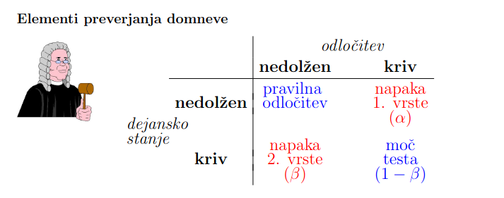

# 3. del

## 1. Vzorcenje in cenilke

- `Definicija enostavnega slucajnega vzorca`
  - Naj bo X slucajna spremenljivka. **Enostavni slucajni vzorec** je slucajni vektor $(X_1, X_2,\dots, X_n)$ za katerega velja:
    1.  vsi cleni vektorja $X_i$ imajo **enako porazdelitev** kot spremenljivka X
    1.  cleni $X_i$ so med seboj **neodvisni**
- `Vzorcne sredinske mere (modus, mediana, povprecje)`
  - **vzorcni modus** je najpogostejsa vrednost
  - **vzorcna mediana** je srednja vrednost glede na urejenost
    $$M_e = \left\{ \begin{array}{lr} Y_{n+1}/2 & ,n - \text{ liho} \\ \frac{Y_{n/2}+Y_{n/2+1}}{2} &,n - \text{ sodo} \end{array} \right\}$$
  - **vzorcno povprecje** je povprecna vrednost
    $$\overline{X}=\frac{1}{n}\sum\limits^n_{i=1}X_i$$
- `Vzorcne mere razprsenosti (razmik, varianca, standardni odklon)`
  - **vzorcni razmah/razmik**: $\max\limits_i x_i - \min\limits_i x_i$
  - **Vzorcna disperzija**: $s^2_0 = \frac{1}{n} \sum\limits_{i=1}^n (x_i-\overline{x})^2$
  - **Popravljen vzorcna disperzija** $s^2 = \frac{1}{n-1} \sum\limits_{i=1}^n (x_i-\overline{x})^2$
  - **vzorcna odklona**: $s_0$ in s
- `Vzorcne mere oblike porazdelitve (koeficienta asimetrije in sploscenosti)`
  - **koeficient asimetrije** (s centralnimi momenti): $g_1 = \frac{m_3}{m_2^{3/2}}$
  - **koeficient sploscenosti** (s centralnimi momenti): $K=g_2=\frac{m_4}{m_2^2-3}$
- `Definicija cenilke`
  > cenilka je pravilo ali formula, ki nam pove, kako izracunati numericno oceno parametra populacije na osnovi merjenj vzorca.
  - **Cenilka** parametra $\zeta$ je vzorcna statistika $C=C(X_1,\dots,X_n)$, katere porazdelitveni zakon je odvisen
    le od parametra $\zeta$, njene vrednosti pa lezijo v prostoru parametrov. SEveda je odvisna tudi od velikosti vzorca n.
    |Parameter | Cenilka $f(X_1,X_2,\dots, X_n)$ | Ocena $f(x_1,x_2,\dots, x_n)$|
    | - | - | - |
    | Pricakovana vrednost $\mu$ | $\overline{X}=\frac{1}{n} \sum\limits_{i=1}^n X_i$ | $\overline{x}=\frac{1}{n} \sum\limits_{i=1}^n x_i$ |
    | Standardni odklon $\sigma$ | $S=\sqrt{\frac{1}{n-1}\sum\limits_{i=1}^n(X_i-\overline{X})^2}$ | $s=\sqrt{\frac{1}{n-1}\sum\limits_{i=1}^n (x_i-\overline{x})^2}$
    | Verjetnost $p$ | $\overline{X}=\frac{1}{n} \sum\limits_{i=1}^n X_i$ | $\overline{x}=\frac{1}{n}\sum\limits_{i=1}^n x_i$ |
- `Vpelji nepristranskost in doslednost cenilke`
  - Cenilka $C_n$ parametra $\zeta$ je **nepristranska**, ce je $E(C_n)=\zeta, \forall n$
  - Cenilka $C_n$ parametra $\zeta$ je **dosledna** ce z rastocim n zaporedje $C_n$ verjetnostno konvergira k parametru
    $\zeta$, tj. za vsak $\epsilon > 0$, velja
    $$\lim\limits_{n\rightarrow \infty} P(|C_n - \zeta)< \epsilon) = 1$$
- `CLI`
  - Naj bo $(X_1, X_2, \dots, X_n)$ normlano porazdeljen enostavni slucajni vzorec.
    - $X_i \sim N(\mu, \sigma)$
  - Potem je porazdelitev vzorcnega povprecja $\overline{X}= \frac{1}{n} \sum\limits_{i=1}^n X_i$ tudi normalna:
    $$\overline{X}\sim N(\mu, \frac{\sigma}{\sqrt{n}})$$

## 2. CLI za $\overline{X}$

**Vzorcno povprecje normalno porazdeljenga vzorca**. Naj bo $(X_1, X_2,\dots X_n)$ normlano porazdeljen enostavni slucajni
vzorec, $X_i \sim N(\mu,\sigma)$. Potem je porazdelitev vzorcnega povprecja $\overline{X}=\frac{1}{n}\sum\limits_{i=1}^n X_i$ tudi normalna.
$$\overline{X}\sim N(\mu, \frac{\sigma}{\sqrt{n}})$$

**CLI za vzorcno povprecje**. Naj bo $(X_1,\dots, X_n)$ slucajni vzorec in $E(X_i)=\mu$ ter $D(X_i)=\sigma^2 < \infty$, potem
za dovolj velik vzorec $n\geq 30$:
$$\overline{X}\sim N(\mu, \frac{\sigma}{\sqrt{n}})$$

## 3. CLI za delez
Denimo, da zelimo na populaciji oceniti delez enot $\pi$ z doloceno lastnostjo. V ta namen poiscemo vzorcni delez p.
Pokazati se da, da se za dovolj velike slucajne vzorce s ponavljanjem, vzorcni delezi poradeljujejo priblizno normalno s
- pricakovano vrednostjo vzorcnih delezev enako delezu na populaciji $E(\hat{P})=\pi$
- standardnim odklonom vzorcnih delezov $\text{SE}(\hat{P})=\sqrt{\frac{\pi(1-\pi)}{n}}$

Za manjse vzorce se vzorcni delez porazdeljuje `binomsko`. Mimogrede, cenilka populacijskega deleza je nepristranska
ker velja $E(\hat{P})=\pi$
- cenilka za delez $\pi$
    - $\hat{p}=\frac{\sum X_i}{n}=\overline{X}$
- n > 20
    - $\hat{p}\sim N(\pi, \sqrt{\frac{\pi (1-\pi)}{n}})$
- n < 20
    - $\hat{p}\sim B(\pi, \sqrt{\frac{\pi(1-\pi)}{n}})$

## 4. CLI za $S^2$
Naj bo slucajna spremenljivka X na neki populaciji porazdeljena normalno $N(\mu, \sigma)$.
> Kako bi dolocili porazdelitev za vzorcno disperzijo ali popravljeno vzorcno disperzijo tj.:
- $S_0^2 = \frac{1}{n} \sum\limits_{i=1}^n (X_i-\overline{X})^2$ oziroma $S^2=\frac{1}{n-1} \sum\limits_{i=1}^n (X_i-\overline{X})^2$?

Raje izracunamo porazdelitev za naslednjo vzorcno statistiko:
$$\chi^2 = \frac{nS_0^2}{\sigma^2}=\frac{n-1S^2}{\sigma^2}=\frac{1}{\sigma^2} = \sum\limits_{i=1}^n (X_i-\overline{X})^2$$
Ker vemo, da je $E(\chi^2(n))=n$  in $D(\chi^2(n))=2n$ lahko takoj izracunamo:
- $E(S_0^2)=E(\frac{\sigma^2\chi^2}{n})=\frac{(n-1)\sigma^2}{n}$, $E(S^2)=E(\frac{\sigma^2 \chi^2}{n-1})=\sigma^2$
- $D(S_0^2)=D(\frac{\sigma^2\chi^2}{n})=\frac{2(n-1)\sigma^4}{n^2}$, $D(S^2)=D(\frac{\sigma^2\chi^2}{n-1})=\frac{2\sigma^4}{n-1}$

Za dovolj velike n je:
- statistika $\chi^2$ porazdeljena priblizno normalno in sicer po zakonu $N(n-1, \sqrt{2(n-1)})$
- vzorcna disperzija $S_0^2$ priblizno po $N(\frac{(n-1)\sigma^2}{n}, \frac{\sigma^2\sqrt{2(n-1)}}{n})$ in
- popravljena vzorcna disperzija $S^2$ priblizno po $N(\sigma^2, \sigma^2 \sqrt{\frac{2}{n-1}})$

## 5. CLI za razliko vzorcnih povprecij

Denimo da imamo dve populaciji velikosti $N_1$ in $N_2$ in se spremenljivka X na prvi populaciji porazdeljuje noralno $N(\mu_1,\sigma)$
na drugi populaciji pa $N(\mu_2,\sigma)$ (standardna odklona sta na obeh populacijah enaka). V vsaki od obeh populacij
tvorimo neodvisno slucajne vzorce velikosti $n_1$ in $n_2$. Na vsakem vzorcu (s ponavljanjem) prve populacije izracunamo
vzorcno povprecje $\overline{X}_ 1$ in podobno na vsakem vzorcu druge populacije $\overline{X}_ 2$. Po reprodukcijski
lastnosti normalne porazdelitve __je porazdelitev velikih vzorcnih povprecij normalna__ kjer je:

- **pricakovana vrednost razlik** vzorcnih povprecij enako
 $$E(\overline{X}_ 1-\overline{X}_ 2)=E(\overline{X}_ 1)-E(\overline{X}_ 2)=\mu_1 - \mu_2$$
- **disperzija razlik vzorcnih povprecij** enaka:
  $$D(\overline{X}_ 1-\overline{X}_ 2)=D(\overline{X}_ 1)+D(\overline{X}_ 2)=\frac{\sigma^2}{n_1}+\frac{\sigma^2}{n_2}$$

## 6. CLI za razliko delezev

Podobno kot pri porazdelitvi razlik vzorcnih povprecij naj bosta dani dve populaciji velikosti $N_1$ in $N_2$ z delezema
enot z neko lastnostjo $\pi_1$ in $\pi_2$. Iz prve populacije tvorimo slucajne vzorce velikosti $n_1$ in na vsakem izracunamo delez
enot s to lastnostjo $p_1$. Podobno naredimo tudi na drugi populaciji; tvorimo slucajne vzorce velikosti $n_2$ in na
njih dolocimo deleze $p_2$.

Pokazati se da, __da se za dovolj velike vzorce razlike vzorcnih delezev porazdeljujejo priblizno normalno s__

- __pricakovano vrednostjo__ razlik vzorcnih delezev
  $$E(\hat{P_1}-\hat{P_2})=E(\hat{P_1})-E(\hat{P_2})=\pi_1 - \pi_2$$
- __disperzijo__ razlik vzorcnih delezev
  $$D(\hat{P_1}-\hat{P_2})=D(\hat{P_1})+D(\hat{P_2})=\frac{\pi_1(1-\pi_1)}{n_1}+\frac{\pi_2(1-\pi_2)}{n_2}$$

## 7. CLI za kvocient $S^2_1/ S^2_2$
Po zakonu $F(m-1, n-1)$ je na primer razdeljena statistika
$$F=\frac{S_X^2/ \sigma_X^2}{S_Y^2/ \sigma_Y^2}$$
kjer sta X in Y neodvisni slucajni spremenljivki, saj vemo, da sta spremenljivki
$$U=(m-1)S^2_X/\sigma_X^2 \text{ in } V=(n-1)S_Y^2 / \sigma_Y^2$$
porazdeljeni po $\chi^2$ z m-1 oziroma n-1 prostostnimi stopnjami in sta tudi neodvisni.

Za konec omenimo se dve koristni trditvi:
- za $U\sim F(m,n)$, je $1/U \sim F(n,m)$
- za $U\sim t(n)$, je $U^2\sim F(1,n)$

- `Kako zacnemo (kaj nas pravzaprav zanima)?`
- `predpostavke`
- `izbira vzorca`
- `slucajni vektor, ki spremlja nakljucno izbran vzorec`
- `izbira cenilke`
- `izrek, ki nam zagotovi normalno porazdelitev`
- `parameter μ te normalne porazdelitve`
- `parameter σ te normalne porazdelitve`
- `kaj je pomembno pri drugem parametru`
- `uporaba`

## 8. Intervali zaupanja
- `interval zaupanja σ je znan`
    - Za konstrukcijo intervala zaupanja uporabljamo dejstvo
        $$\frac{\overline{X}-\mu}{\frac{\sigma}{\sqrt{n}}}\sim N(0,1)$$
    - Slucajna spremenljivka X je normlano porazdeljena ali imamo dovolj veliki vzorec (za uporabo CLI)
    - Z verjetnostjo $1-\alpha$ se $\mu$ nahaja na intervalu $\left[\overline{X}-\epsilon, \overline{X}+\epsilon\right]$
    - Dobi se $\epsilon = c\frac{\sigma}{\sqrt{n}}$
    - $I_\mu = \left[ \overline{X}-c \frac{\sigma}{\sqrt{n}}, \overline{X}+c\frac{\sigma}{\sqrt{n}}\right]$
    - $c = F^{-1} (1-\frac{\alpha}{2})$
    - $1-\alpha$ je __stopnja zaupanja__, $\alpha$ je __stopnja tveganja__
    - __Sirina (dolzina)__ intervala zaupanja je $l=2c\frac{\sigma}{\sqrt{n}}$

__Primer__: Signal intenzitete $\mu$ je poslan z lokacije A. Na lokaciji B se belezi sprejet signal.
Zaradi sumenja signal zaznamo z nakljucno napako. Intenziteta signala na lokaciji B je normalno porazdeljena slucajna 
spremenljivka s povprecjem $\mu$ in standardnim odklonm 3. Da bi zmanjsali napako, isti signal neodvisno belezimo 10-krat.
Dobili smo naslednje vrednosti intenzitete signala na lokaciji:
$$B:17,21,20,18,19,22,20,21,16,19$$
Doloci 95% interval zaupanja za $\mu$
- n = 10,$\sigma=3$, $\alpha$=0.05, $c=F^{-1}(1-\frac{\alpha}{2})$, $\overline{x}=19.3$
    - c pogledamo v tabeli za $c=F^{-1}(0.975)=1.9$
- Interval zaupanja $I_\mu = \left[17.5, 21.1 \right]$

- `interval zaupanja σ ni znan`
    - Za konstrukcijo intervala zaupanja uporabljamo dejstvo
        $$\frac{\overline{X}-\mu}{\frac{S}{\sqrt{n}}}\sim t_{n-1}$$
    - Interval zaupanja za $\mu$ s stopnjo zaupanja $1-\alpha$ je enak
        $$I_\mu = \left[ \overline{X}-c\frac{S}{\sqrt{n}}, \overline{X}+c\frac{S}{\sqrt{n}}\right]$$
    - kjer je $c=t_{n-1;1-\frac{\alpha}{2}}$ kvantil __Studentove porazdelitve__ z $n-1$ prostnostnimi stopnjami (stevilo vzorca)

__Primer__: Na vzorcu 30 zensk so dobili povprecje 6 in popravljeni standardni odklon 5 kolicine PCB-jev. Doloci 
99% interval zaupanja za povprecno kolicino PCB-jev.
- $\overline{x}=6$, $s=5$, $\alpha=0.01$, $n=30$, $c=t_{29;0.995}$
- $I_\mu = \left[ \overline{x}-c\frac{s}{\sqrt{n}}, \overline{x}+c\frac{s}{\sqrt{n}} \right]=\left[3.5, 8.5\right]$

- `interval zaupanja za delez p`
    - p je delez populacije z neko lastnostjo
    - naj bo $(X_1, X_2, \dots, X_n)$ enostavni slucajni vzorec, kjer je $X_i \sim \begin{pmatrix} 0 & 1 \\ 1-p & p \end{pmatrix}$, $i=1,...,n$
    - neznani delez p ocenjujemo z vzorcnim delezom $\hat{p}=\overline{X}=\frac{1}{n} \sum\limits_{i=1}^n X_i$
    - za konstrukcijo intervala uporabimo dejstvo $\hat{p}\sim N(p, \sqrt{\frac{p(1-p)}{n}})$
    - Interval zaupanja $I_p = \left[ \hat{p}-c\sqrt{\frac{\hat{p}(1-\hat{p})}{n}}, \hat{p}+c\sqrt{\frac{\hat{p}(1-\hat{p})}{n}}\right]$
    - kjer je $c=F^{-1}(1-\frac{\alpha}{2})$ kvantil standardne normalne porazdelitve

- `definicija tockovne ocene za parameter, primeri (vsaj 3)`
- `pomen stopnje zaupanja`
- `postopek intervalskega ocenjevanja`
- `kdaj uporabimo Studentovo porazdelitev`
    - ko nepoznamo standardnega odklona populacije $\sigma$ ter imamo dokaj majhen vzorec $n<30$
- `kaj je drugace, ko imamo majhen vzorec`
    - nemoremo uporabiti izreka za CLI
- `izbira velikosti vzorca`
- `izpeljava formule za interval zaupanja`

## 9. Preverjanje domnev
- `uvod`
    - __Statisticna domneva__ je vsaka domneva o porazdelitvi slucajne spremenljivke X na populaciji
    - Ce poznamo vrsto(obliko) porazdelitve in razkisujemo domnevo o parametru __a__ govorimo o __parametricni domnevi__
    - Ce pa je vprasljiva vrsta porazdelitve govorimo o __neparametricni domnevi__
    - Domneva je:
        - __enostavna__: ce natancno doloca porazdelitev (vrsto in tocno vrednost parametra)
        - __sestavljena__: sicer
    - __Primer__: Naj bo $X\sim N(\mu, \sigma)$, ce poznamo $\sigma$ je domneva $H:\mu =0$ enostavna; ce pa parametra
     $\sigma$ nepoznamo pa je sestavljena
        - primer sestavljene je tudi $H: \mu>0$
    - Domneva je lahko:
        - __pravilna__ (podatki domnevo podpirajo)
        - __napacna__ (podatki prevec odstobajo od domneve)
- `Nicelna in alternativna domneva`
    - __Nicelna domneva__ ($H_0$)
        - je trditev o lastnosti populacije za katero predpostavimo da drzi (verjamemo da je resnicna)
        - je trditev ki jo test zeli ovreci
    - __Alternativna (nasprotna) domneva__ $H_a \text{ ali } H_1$
        - trditev, ki ni zdruzljiva z nicelno domnevo
        - trditev, ki jo s testiranjem skusamo dokazati
    - __Primer__: Ameriski sodni sistem
        - $H_0$: obtozenec je nedolzen (nicelna domneva)
        - $H_a$: obtozenec je kriv (alternativna domneva)

            

- `Napaka 1. vrste, 2. vrste`
    - __Napaka 1. vrste__ je zavrnitev nicelne domneve, ce je le ta pravilna. Verjetnost da naredimo napako 1. vrste 
    - __Napaka 2. vrste__ je ko ne zavrnemo nicelne domneve v primeru da je ta napacna. Verjetnost te napake je $\beta$
- `P-vrednost`
    - __P-vrednost__ oziroma __stopnja znacilnosti/signifikantnosti testa__ je najvecja vrednost parametra $\alpha$ 
        ki jo je vodja eksperimenta pripravljen sprejeti glede na dan vzorec.
- `Moc statisticnega testa`
    - __Moc statisticnega testa__ (1-$\beta$) je verjetnost zavrnitve nicelne domneve v primeru, ko je ta v resnici napcna.

## 10. Bivariatna analiza in regresija
- Gledamo odvisnost oziroma povezanost spremenljivk
    - $X\leftrightarrow Y$ povezanost
    - $X\rightarrow Y$ odvisnost
- `Povezanost dveh imenskih spremenljivk`
- `preverjanje povezanosti slucajnih spremenljivk (glede na tip slucajnih spremenljivk)`
  - Mere povezanosti locimo glede na tip spremenljivk:
    1. IMENSKI/NOMINALNI tip para spremenljivk (ena od spremenljik je imenska/nominalna) $\chi^2$ test, kontinguencni koeficienti, koeficineti asociacije
    1. ORDINALNI tip para spremenljivk (ena spremenljivka je ordinalna druga ordinalna ali boljsa) **koeficient korelacije rangov**
    1. STEVILSKI tip para spremenljivk (spremenljivki sta stevilski): **koeficient korelacije**
- `preverjanje neodvisnosti imenskih slucajnih spremenljivk`
- `koeficient korelacije (Pearsonov, Spearmanov), preverjanje domneve o parametru ρ`
  - **Pearsonov koeficient**: $\phi=\chi^2/n$, ki ima zgornjo mejo $\phi_{\text{max}}^2=k-1$
  - \_\_
- `linearna regresija (definicije, predpostavke, metoda najmanjsih kvadratov)`
  - The goal of simple linear regression is to create a linear model that minimizes the sum of squares of the residuals / error (SSE)
- `casovne vrste in definicija trenda`
- `Staticni test linearnosti mo`
